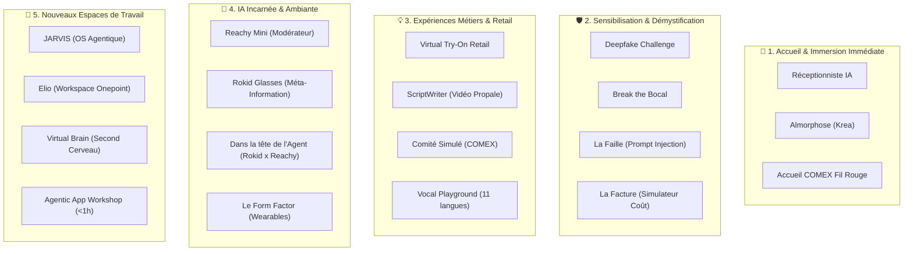

# 🎪 Catalogue des Expériences de l'Agentic Livepoint

> **Source :** `[AI LAB] Deck marketing de l'agentique livepoint V2.pptx` (Diapositives 30 à 55).  
> **Lieu :** Espace immersif Agentic Livepoint — OnePoint (Paris).  
> **Principe clé :** *« Voir de vos yeux, mettre les mains »* — Des cas d'usage manipulables en direct pour dépasser le buzz et tester la maturité réelle des technologies.

---

## 🗺️ Vue d'Ensemble par Pôle Expérientiel

---

## 📌 Détail des Expériences du Catalogue

### 1. 🚪 Accueil & Immersion
- **L'accueil COMEX (Fil Rouge) :** À la porte, chaque dirigeant scanne un QR code et exprime en 90s ses attentes et irritants à l'agent vocal. L'agent alimente le mur des attentes, adapte l'ordre du jour en direct et restitue le soir un compte-rendu personnalisé répondant aux questions du matin.
- **Réceptionniste Agentique :** Borne tactile équipée de modèles vocaux ElevenLabs pour orienter, renseigner et qualifier chaque arrivant.
- **Almorphose :** Expérience artistique sur écran géant (moteur Krea AI) transformant instantanément le portrait du visiteur en œuvre d'art vivante.

---

### 2. 🛡️ Sensibilisation, Sécurité & Décryptage
- **Deepfake : distinguer le vrai du faux :** Jeu de discernement entre visuels/vidéos réels et contenus synthétiques, avec génération minute d'un deepfake consenti du visiteur pour illustrer les mécanismes de manipulation.
- **Break the Bocal : d'un LLM à un Agent :** Atelier d'1h (COMEX/DSI) décortiquant les briques fondamentales : comment un modèle statistique devient un agent autonome doté de mémoire, d'outils et de boucles de décision.
- **La Faille (Défi de Prompt Injection) :** Challenge ludique en 8 étapes où les participants tentent d'extraire un secret protégé dans la base de connaissances d'un agent pour comprendre les failles de sécurité en entreprise.
- **La Facture :** Simulateur interactif de coûts (coût par token/API vs modèle de licence logicielle classique) pour anticiper et maîtriser le budget IA à l'échelle.

---

### 3. 💡 Expériences Métiers, Voix & Création
- **Virtual Try-On & Suite Retail AI :** Démonstrateur d'essayage virtuel en pied, shooting produit 360° et recommandation personnalisée.
  - *Fiche associée :* [[01 - Projects/Stage OnePoint - AI Lab/Fiches Techniques/FT04 - Experiences Retail AI Virtual Try On|FT04 — Retail AI]]
- **ScriptWriter (Production Vidéo Accélérée) :** Transformation d'un brief oral ou PDF en vidéo publicitaire ou proposition commerciale en quelques minutes via Remotion et Kling 1.6.
  - *Fiche associée :* [[01 - Projects/Stage OnePoint - AI Lab/Fiches Techniques/FT01 - Agent Video Propale Remotion Lambda|FT01 — Agent Vidéo]]
- **Votre Comité Simulé... et ce qui lui échappe :** Soutenance d'un arbitrage réel face à un comex d'agents virtuels avec jauges d'adhésion en direct.
  - *Fiche associée :* [[01 - Projects/Stage OnePoint - AI Lab/Fiches Techniques/FT05 - Vocal Playground et Comite Simule|FT05 — Comité Simulé]]
- **Vocal Playground :** Enregistrement de sa voix et restitution instantanée dans 11 langues avec préservation intégrale du timbre et de l'émotion.
  - *Fiche associée :* [[01 - Projects/Stage OnePoint - AI Lab/Fiches Techniques/FT05 - Vocal Playground et Comite Simule|FT05 — Vocal Playground]]
- **Scooter Quizz :** Évaluation des connaissances gamifiée où un agent génère dynamiquement des questions contextuelles adaptées au métier du joueur.

---

### 4. 🤖 Informatique Ambiante & Robotique
- **Reachy Mini (Pollen Robotics x Hugging Face) :** Robot incarné posé au centre de la table, modérateur de réunion avec posture de silence par défaut.
  - *Fiche associée :* [[01 - Projects/Stage OnePoint - AI Lab/Fiches Techniques/FT06 - Reachy Mini Robotique et MuJoCo|FT06 — Reachy Mini]]
- **Visite Assistée & Lunettes Rokid :** Lunettes connectées projetant de la méta-information contextuelle en scannant les objets du Lab.
  - *Fiche associée :* [[01 - Projects/Stage OnePoint - AI Lab/Fiches Techniques/FT07 - Lunettes IA Rokid Glasses et Wearables|FT07 — Lunettes Rokid]]
- **Dans la tête de l'Agent (Rokid x Reachy) :** Synchronisation live où Reachy parle pendant que le visiteur voit défiler dans les lunettes sa chaîne de raisonnement et ses appels d'outils.
  - *Fiche associée :* [[01 - Projects/Stage OnePoint - AI Lab/Fiches Techniques/FT08 - Multimodal Rokid x Reachy|FT08 — Rokid x Reachy]]
- **Le Form Factor :** Manipulation comparée d'objets IA (enregistreur Plaud, lunettes Rokid, montre Huawei, Rabbit r1, robots) pour évaluer ce que chaque capteur capte réellement.
- **Project Astra (Google) :** Démonstrateur de vision temps réel multimodale pour assister un technicien pointant sa caméra sur une machine industrielle défaillante.

---

### 5. 🚀 Organisation du Futur & Nouveaux Workspaces
- **JARVIS (L'OS Agentique) :** Exploration d'un système d'exploitation proactif doté de la mémoire de l'entreprise, préparant les réunions et gérant les boîtes mails en autonomie.
- **Elio Workspace :** Présentation du nouveau workspace agentique interne déployé pour les consultants Onepoint.
- **Virtual Brain (Le Second Cerveau d'Entreprise) :** Centralisation et interconnexion de tout le patrimoine de connaissances (décisions, comptes-rendus, études) interrogeable en langage naturel.
- **La Forge (L'Usine à Agents) :** Générateur visuel d'assistants IA spécialisés exploitant le méta-prompting sans nécessiter de compétences en programmation.
- **Agentic App Workshop :** Atelier de co-conception de 60 minutes permettant de transformer un irritant métier client en un prototype fonctionnel testable séance tenante.

---

## 🔗 Liens & Références
- [[01 - Projects/Stage OnePoint - AI Lab/Index du Stage|Index général du stage OnePoint]]
- [[01 - Projects/Stage OnePoint - AI Lab/Offre & Parcours Client — Agentic Livepoint|Offre & Parcours Client]]
- [[03 - Resources/Vision Frontier Firm & Organisation Agentique|Vision Stratégique Frontier Firm]]
