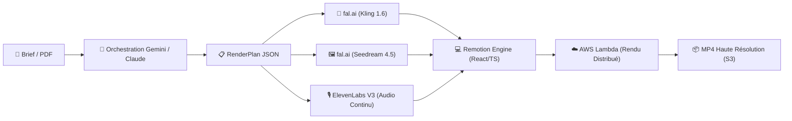

# 🎬 Fiche Technique 01 : Agent Vidéo de la Propale (ScriptWriter)

> **Application en Production :** `https://ellis-tau.vercel.app` (Module *Agents de vente*).  
> **Rôle d'Émilie :** Conception de bout en bout du pipeline génératif, architecture serverless et moteur de rendu vidéo par le code.

---

## 🎯 1. Objectif & Impact Métier
Automatiser la production de vidéos de propositions commerciales ou de concepts (30s à 2min) à partir d'un brief ou PDF d'inspiration. Le cycle de production vidéo passe de **plusieurs semaines (en agence externe) à quelques minutes en totale autonomie**, avec un rendu respectant la charte graphique de Onepoint et du client ciblé.

---

## 🛠️ 2. Ce que j'ai Conçu & Développé
- **Génération de Scénario & RenderPlan :** Pipeline d'ingestion de brief via Gemini (3.1/2.5 Flash) pour générer un plan de montage modulaire (*RenderPlan JSON* découpé en beats).
- **Moteur de Montage Video-as-Code (Remotion) :** Composition programmatique React/TypeScript orchestrant les clips vidéo, les images clés, les titrages, sous-titres Poppins et transitions dynamiques au millième de seconde.
- **Rendu Distribué Serverless (AWS Lambda) :** Déploiement de l'infrastructure de rendu cloud (Lambda + S3 + IAM) parallélisant le calcul vidéo pour exporter le MP4 final sans saturer la machine cliente.
- **Design System Vidéo Onepoint :** Développement en code de 5 transitions vectorielles exclusives (`o-wipe`, `arc-sweep`, `dot-punch`, `donut-iris`, `only-the-o`) et application programmatique de l'effet Ken Burns (6 mouvements calculés).
- **Audio & Voix Off Continue :** Intégration d'un flux audio unifié ElevenLabs (v3 Multilingual) avec modulation émotionnelle par tags (`[excited]`, `[whisper]`) et fond sonore généré par Stable-Audio.

---

## 🏗️ 3. Architecture Technique

---

## ⚡ 4. Défis Techniques Résolus (Preuves de Compétence)

| Défi Rencontré | Cause Racine Identifiée | Solution Technique Déployée |
|:---|:---|:---|
| **Optimisation budgétaire GPU** | Modèle vidéo initial (Seedance 2.0) prohibitif (~3.02 $ pour 10s). | Migration et benchmark vers **Kling 1.6 (~1.26 $ pour 10s)** : coût de génération divisé par 2.4 à qualité cinématique égale. |
| **Coupures audio entre séquences** | La génération audio découpée par beat créait des blancs et ruptures de ton. | Conception d'une **narration globale en flux audio continu unique**, synchronisée avec Remotion via un buffer de sécurité de +1.5s. |
| **Échec du rendu cloud Lambda** | La balise standard HTML `` n'était pas attendue par le moteur de rendu headless. | Remplacement par le composant natif Remotion `` garantissant le préchargement asynchrone avant chaque frame. |
| **URLs médias expirées** | Les URLs fal.ai expiraient rapidement lors de la retouche manuelle d'images. | Bascule vers l'API `gemini-3.1-flash-image-preview` permettant l'édition directe en base64 sans dépendance d'hébergement tiers. |
| **Sécurité des clés d'API** | Risque d'exposition des secrets côté client dans l'application web. | Création de **proxies d'API serverless** sur Vercel : 100 % des clés (fal, ElevenLabs, Gemini, AWS) isolées côté serveur. |

---

## 📊 5. Métriques & Résultats Chiffrés
- **Temps de production :** Réduit de **2 à 3 semaines** à **moins de 5 minutes** par vidéo.
- **Coût de rendu AWS :** **0.04 $ au total** pour plusieurs centaines d'invocations (optimisation complète du Free Tier AWS Lambda).
- **Coût d'inférence par vidéo 30s :** ~3.00 $ tout compris (vidéo Kling, images Seedream, narration ElevenLabs et musique).

---

## 🔗 Liens & Connexions Graphe
- [[01 - Projects/Stage OnePoint - AI Lab/Index du Stage|Index général du stage OnePoint]]
- [[01 - Projects/Stage OnePoint - AI Lab/Fiches Techniques/FT02 - Agent Proposition Commerciale PPTX|FT02 — Agent Proposition Commerciale PPTX (Ellis Suite)]]
- [[01 - Projects/Stage OnePoint - AI Lab/Fiches Techniques/FT05 - Vocal Playground et Comite Simule|FT05 — Vocal Playground (Clonage Vocal ElevenLabs)]]
- [[02 - Areas/Compétences & R&D IA/Video-as-Code & Motion Design (Remotion & Lambda)|Compétence : Video-as-Code & Remotion]]
- [[02 - Areas/Compétences & R&D IA/Architecture Agentique & Meta-Prompting|Compétence : Architecture Agentique & Meta-Prompting]]
- [[02 - Areas/Compétences & R&D IA/Cloud Serverless & Sécurité des Systèmes IA (AWS, Vercel)|Compétence : Cloud & Sécurité]]
- [[03 - Resources/MOC - Carte des Connaissances & Graphe|🗺️ MOC — Carte des Connaissances & Graphe]]
