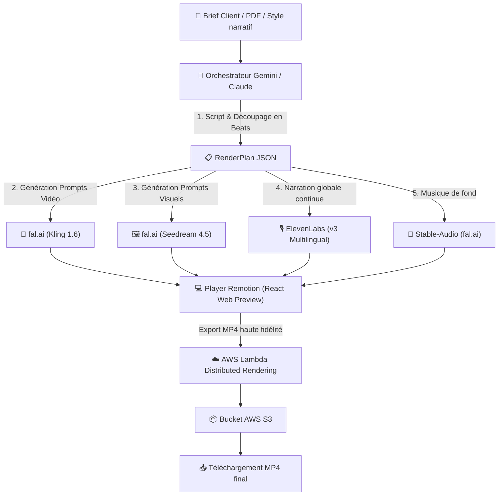

# 🎬 Fiche Technique 01 : Agent Vidéo de la Propale (ScriptWriter / Ellis)

> **Référence Deck Marketing :** Diapositive 55 (*ScriptWriter : la production audiovisuelle qui passe de plusieurs semaines à quelques minutes*) & Diapositive 30/35 (*Software : fal.ai, Remotion, ElevenLabs*).  
> **Accès Déployé :** `https://ellis-tau.vercel.app` (Section *Agents de vente*).

---

## 📌 1. Contexte & Objectifs Métier

Dans le cadre des réponses aux appels d'offres (RFP) et des présentations commerciales grands comptes de Onepoint, la production de vidéos conceptuelles prenait habituellement plusieurs semaines et des budgets d'agence élevés.
L'objectif du projet **ScriptWriter** était de concevoir un **agent autonome de génération vidéo de bout en bout** capable de transformer un brief commercial ou un cahier des charges PDF en une vidéo publicitaire/corporate professionnelle de 30 secondes à 2 minutes en quelques minutes, intégrant l'ADN visuel Onepoint et respectant la charte du client ciblé.

---

## 🏗️ 2. Architecture Technique Globale

---

## ⚙️ 3. Stack Technologique & Modèles

| Domaine | Outil / Modèle | Rôle & Justification |
|:---|:---|:---|
| **Moteur Vidéo par le code** | **Remotion (React + TypeScript)** | Permet un montage vidéo frame-by-frame déterministe, composition programmatique de texte, animations motion design et habillage dynamique. |
| **Rendu Distribué Cloud** | **Remotion Lambda (AWS Lambda + S3 + IAM)** | Rendu déporté serverless permettant d'exporter en MP4 sans surcharger la machine cliente ni le serveur web. |
| **Génération Vidéo IA** | **Kling 1.6 (via fal.ai)** | Rendu cinématique de scènes vidéo avec prompts réalistes corporate. |
| **Génération Image IA** | **Seedream 4.5 & Gemini 3.1 Flash Image Preview** | Génération d'images clés et retouche directe en base64 pour éviter les URLs expirées. |
| **Synthèse Vocale & Voix Off** | **ElevenLabs (Multilingual v2 & v3)** | Voix françaises natives (Charlotte & Liam) avec gestion fine des émotions (`[excited]`, `[whisper]`, `[pause]`). |
| **Musique & Ambiance** | **Stable-Audio (fal.ai)** | Génération de fonds sonores d'ambiance adaptés au style narratif. |
| **Orchestration LLM** | **Google Gemini (3.1 Flash / 2.5 Flash) & Claude 3.5 Sonnet** | Gemini pour l'analyse du brief, le storyboard et le script ; Claude pour la production et validation du code Remotion. |
| **Hébergement & Sécurité** | **Vercel Serverless Functions** | Hébergement de l'application Ellis avec masquage complet des clés d'API derrière des proxies serveur. |

---

## 💰 4. Arbitrages Technico-Économiques & Coûts

- **Modèle Vidéo :** Tests initiaux sur **Seedance 2.0** abandonnés en raison de son coût prohibitif (~3.02 $ pour seulement 10 secondes de vidéo). Migration réussie vers **Kling 1.6** à environ **1.26 $ pour 10 secondes**, offrant un niveau de réalisme équivalent pour un coût réduit de 58 %.
- **Coût total par vidéo 30s :** ~3.00 $ par génération complète (incluant images Seedream, clips Kling, voix off ElevenLabs et musique de fond).
- **Facturation AWS Lambda :** **0.04 $** sur l'ensemble de la période d'expérimentation grâce à l'exploitation optimale du Free Tier AWS (1 million d'invocations/mois gratuites).

---

## 🎨 5. Direction Artistique & ADN Onepoint

Pour dépasser le rendu « générique IA », une analyse approfondie des vidéos institutionnelles de Onepoint a été menée pour injecter des **Prompts Maîtres** et des briques de code dédiées :
1. **Charte graphique native :** Noir profond, Bleu azur, Teal Onepoint, typographie Poppins.
2. **Bibliothèque de transitions signature Onepoint :** 5 motifs géométriques créés en SVG/Canvas Remotion avec rotation automatique pour éviter les répétitions :
   - `o-wipe`
   - `arc-sweep`
   - `dot-punch`
   - `donut-iris`
   - `only-the-o`
3. **Effet Ken Burns dynamique :** Application systématique de 6 variations de mouvements fluides (zoom-in, pan-left, slight-tilt) sur les visuels statiques pour supprimer l'effet diaporama.
4. **Cinq styles narratifs configurables :** Anime/Manga, Film muet noir & blanc années 1920, Cyberpunk néon, Western, Pixel Art / Rétro-gaming.

---

## 🧪 6. Benchmark & Expérimentation Google Flow vs Remotion

Un banc d'essai comparatif a été réalisé entre **Google Flow (Veo)** et **Remotion** :
- **Google Flow (Veo) :** Génération native rapide et parcours storyboard intégré, mais limitations majeures : strict blocage des visuels dès détection de personnalités réelles (ex: test avec Alan Turing bloqué par les filtres deepfake), durée limitée à 10s par scène, et manque de contrôle sur le timing précis au millième de seconde.
- **Remotion + Kling :** Exige un pipeline plus complexe, mais offre un contrôle créatif total frame par frame, une séparation claire entre la voix continue, le motion design et la vidéo, et une intégration industrielle automatisée.

---

## 🐛 7. Incidents Techniques & Résolutions

| Problème Rencontré | Cause Racine | Solution Implémentée |
|:---|:---|:---|
| **Erreur SSL Node.js en local** | Certificats d'entreprise corporatifs bloquant les requêtes HTTPS sortantes. | Configuration d'un proxy intermédiaire et injection des certificats racine. |
| **Code couleur textuel affiché dans l'image** | Les prompts injectaient le code hexadécimal `#000000` que le modèle interprétait littéralement comme du texte à peindre. | Nettoyage des prompts en amont et description sémantique des couleurs (*"deep black matte background"*). |
| **Coupures brutales de voix off** | La génération audio par scène créait des blancs et des discordances de ton. | Génération d'une narration globale en **un seul flux audio continu**, synchronisée avec Remotion, avec un buffer de sécurité de +1.5s sur la fin. |
| **Échec de chargement des images Lambda** | Utilisation de la balise HTML standard `` non attendue par le moteur de rendu Lambda. | Remplacement systématique par le composant `` natif de Remotion qui garantit le pré-chargement asynchrone avant chaque frame. |
| **URLs fal.ai expirées lors de la retouche** | Les URLs de stockage temporaire fal.ai expiraient rapidement, provoquant des erreurs *Failed to fetch*. | Bascule sur l'API `gemini-3.1-flash-image-preview` permettant l'édition et l'envoi direct d'images encodées en base64. |

---

## 🔗 Liens & Références
- [[01 - Projects/Stage OnePoint - AI Lab/Index du Stage|Index général du stage OnePoint]]
- [[02 - Areas/Compétences & R&D IA/Video-as-Code & Motion Design (Remotion & Lambda)|Fiche de Compétence : Video-as-Code & Remotion]]
- [[02 - Areas/Compétences & R&D IA/Cloud Serverless & Sécurité des Systèmes IA (AWS, Vercel)|Fiche de Compétence : AWS Lambda & Sécurité]]
