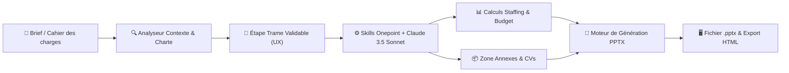

# 📑 Fiche Technique 02 : Agent Proposition Commerciale PPTX (Ellis)

> **Application en Production :** `https://ellis-tau.vercel.app` (Module *Agents de vente*).  
> **Rôle d'Émilie :** Conception de l'architecture agentique sous Anthropic SDK, intégration des chartes Onepoint et moteur de composition de decks PowerPoint.

---

## 🎯 1. Objectif & Impact Métier
Automatiser la génération de présentations commerciales complètes (.pptx) prêtes pour soutenance client à partir d'un cahier des charges PDF ou brief Markdown. L'agent divise par 4 le temps de préparation des propositions commerciales tout en garantissant un strict respect de l'identité graphique Onepoint ou de la charte client.

---

## 🛠️ 2. Ce que j'ai Conçu & Développé
- **Orchestration Multi-Agents (Anthropic Claude 3.5 Sonnet) :** Intégration du SDK *Anthropic Managed Agents* pour analyser le brief, déduire les enjeux stratégiques et générer des slides structurées.
- **Workflow avec Étape « Trame » Intermédiaire :** Conception d'une étape de pré-validation où l'utilisateur visualise, réordonne et valide les messages clés et types de visuels par slide avant la génération lourde du fichier PPTX.
- **Injection de Skills Métier Onepoint :** Intégration des compétences système `Onepoint System` et `onepoint-slide-v2` pour imposer les gabarits, grilles typographiques et codes visuels du cabinet.
- **Moteur Financier & Staffing :** Calcul et mise en forme automatique des grilles de staffing, TJM moyens et budgets prévisionnels par phase projet.
- **Gestion des Annexes & Références :** Insertion automatique de références clients structurées (*Logo + Défi + Résultat chiffré*) et normalisation de CVs multi-formats (PDF/Word/PPTX).
- **Double Rendu :** Export natif PowerPoint `.pptx` et version interactive `Export HTML` avec navigation par cartes.

---

## 🏗️ 3. Architecture Technique

---

## ⚡ 4. Défis Techniques Résolus (Preuves de Compétence)

| Défi Rencontré | Cause Racine Identifiée | Solution Technique Déployée |
|:---|:---|:---|
| **Optimisation temps de génération** | Le chaînage initial Opus + Sonnet prenait plusieurs minutes. | Migration vers une architecture **Full Sonnet** : réduction du temps de génération de 60 % sans perte décelable sur la qualité rédactionnelle. |
| **Plafond de fonctions Vercel** | La formule Vercel limitait le déploiement à 12 serverless functions simultanées. | Fusion logique des endpoints d'analyse de brief et de génération de trame au sein d'un routeur unifié. |
| **Échecs d'upload sur pièces jointes** | Les CVs et images haute résolution dépassaient la taille maximale de requête HTTP. | Implémentation d'un module de compression d'images et d'optimisation de payload côté client avant envoi. |
| **Dérive stylistique des diapositives** | Les premiers prompts généraient des slides surchargées en aplats colorés. | Refonte du prompt maître : titres stricts en noir, sous-titres en gris, palette monochrome avec une seule couleur d'accentuation par phase. |

---

## 📊 5. Métriques & Validation sur Cas Réels
- **Temps de génération d'un deck complet (20 slides) :** Moins de **2 minutes**.
- **Cas réels d'entreprise validés :** Decks générés avec succès sur des cas réels grands comptes (Carrefour, Accor, CHANEL, La Banque Postale, Canal+, FDJ United).
- **Taux de fidélité à la charte :** 100 % de conformité sur le positionnement du logo, les marges et la typographie institutionnelle.

---

## 🔗 Liens & Références
- [[01 - Projects/Stage OnePoint - AI Lab/Index du Stage|Index général du stage OnePoint]]
- [[02 - Areas/Compétences & R&D IA/Architecture Agentique & Meta-Prompting|Compétence : Architecture Agentique]]
- [[02 - Areas/Compétences & R&D IA/Cloud Serverless & Sécurité des Systèmes IA (AWS, Vercel)|Compétence : Cloud & Vercel]]
