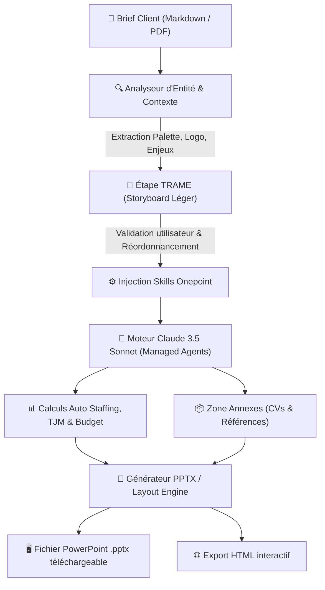

# 📑 Fiche Technique 02 : Agent Proposition Commerciale PPTX (Ellis)

> **Application & Déploiement :** `https://ellis-tau.vercel.app` (Module *Agents Vente* / Agent Proposition Commerciale).  
> **Contexte Lab :** Automatisation de la phase de réponse commerciale pour les consultants Onepoint, en interaction avec les équipes Communication (Judith Soundy) et Sales (Ief Berben).

---

## 📌 1. Contexte & Objectifs

La rédaction et la mise en forme de propositions commerciales (.pptx) pour des appels d'offres représentent un investissement temps colossal pour les équipes de conseil. L'objectif était de créer un agent autonome capable de :
1. Ingérer un cahier des charges client (PDF ou brief Markdown).
2. Déduire automatiquement le positionnement, les enjeux et l'identité visuelle de la cible.
3. Proposer une **Trame narrative** validable et éditable.
4. Générer une présentation PowerPoint (.pptx) prête pour soutenance, rigoureusement fidèle aux chartes graphiques de Onepoint et intégrant des références probantes.

---

## 🏗️ 2. Architecture & Pipeline Fonctionnel

---

## ⚙️ 3. Stack Technologique & Composants Clés

| Composant | Technologie | Description |
|:---|:---|:---|
| **Moteur LLM & Agents** | **Anthropic Claude 3.5 Sonnet** (SDK Anthropic) | Sélectionné après benchmark vs Claude Opus : le passage en *Full Sonnet* a réduit le temps de génération de plus de 60 % avec une qualité rédactionnelle et une cohérence visuelle quasi-identiques. |
| **Framework de Skills** | **Onepoint System + onepoint-slide-v2** | Bibliothèque de règles typographiques, chromatiques et narratives spécifiques aux standards d'excellence du cabinet. |
| **Back-end & Routes API** | **Next.js / Node.js sur Vercel** | Endpoints d'analyse de brief, streaming de trame et génération de deck avec polling d'avancement. |
| **Formatage de Document** | **Générateur PPTX & Export HTML** | Assemblage des slides, positionnement des formes, gestion des masques de diapositive et export HTML complémentaire pour consultation web interactive. |

---

## 💡 4. Innovations UX & Fonctionnalités Clés

- **Le concept de « Trame » intermédiaire :** Plutôt que de générer directement 30 slides à l'aveugle, l'agent génère d'abord une trame concise (une carte = une diapositive). L'utilisateur peut réordonner les slides par glisser-déposer, modifier le message clé, changer le type de visuel et déposer une image spécifique.
- **Section Équipe & Budget dynamique :** Calcul automatique du TJM moyen, de la répartition du staffing et du budget total estimé en fonction des phases du projet.
- **Références clients structurées :** Mise en page automatique des *success stories* Onepoint au format "Logo client + Défi + Solution + Métrique chiffrée" (validé sur des cas réels : Carrefour, Accor, CHANEL, La Banque Postale, Canal+, FDJ United).
- **Annexes intelligentes :** Zone de dépôt multi-formats (CVs, fiches méthodologiques) automatiquement normalisées et insérées en fin de présentation.

---

## 🐛 5. Défis Résolus & Optimisations

| Défi rencontré | Cause | Solution apportée |
|:---|:---|:---|
| **Dépassement du quota de fonctions Vercel** | La formule Vercel limitait le projet à 12 serverless functions simultanées. | Fusion des routes d'analyse de trame et de génération dans un orchestrateur unique. |
| **Erreur de payload sur fichiers volumineux** | Les images et CVs haute définition dépassaient la taille maximale de requête HTTP. | Implémentation d'un compresseur d'images côté client avant envoi aux routes API. |
| **Dérive stylistique des templates** | Les premiers prompts surchargeaient les slides avec des couleurs vives disparates et des bandeaux superposés. | Refonte du prompt maître : titres stricts en noir, sous-titres en gris, palette monochrome avec une seule couleur d'accentuation Onepoint par phase de projet. |
| **Persistance des données de session** | Les rechargements accidentels faisaient perdre l'ensemble du brief et des documents déposés. | Sauvegarde réactive de la session en `localStorage` avec bandeau de restauration au redémarrage. |

---

## 🔗 Liens & Références
- [[01 - Projects/Stage OnePoint - AI Lab/Index du Stage|Index général du stage OnePoint]]
- [[02 - Areas/Compétences & R&D IA/Architecture Agentique & Meta-Prompting|Fiche de Compétence : Meta-Prompting & Agents]]
