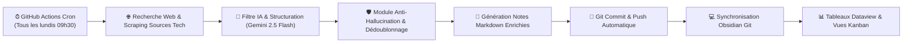

# 📡 Fiche Technique 03 : Agent Veille Événementielle Tech dans Obsidian

> **Localisation Vault :** Dossier `04. Veille` (relié via Obsidian Git).  
> **Cadence d'Exécution :** Automatisée tous les lundis à 09h30 via un workflow GitHub Actions.

---

## 📌 1. Contexte & Problématique

Pour alimenter la stratégie de prospection du Lab IA et préparer les interventions de Onepoint sur les grands salons (Vivatech, Google Cloud Summit, WAIC Shanghai), l'équipe avait besoin d'un suivi exhaustif et continu des conférences, salons et événements IA/Tech en France et à l'international.
Ce travail manuel était chronophage et souffrait d'oublis fréquents. L'objectif était de créer un **agent de veille autonome 100 % déporté dans le cloud**, injectant directement des fiches enrichies dans le coffre Obsidian de l'équipe sans exiger qu'un ordinateur reste allumé.

---

## 🏗️ 2. Architecture Technique

---

## ⚙️ 3. Stack Technologique

| Brique | Outil | Rôle |
|:---|:---|:---|
| **Orchestrateur Cloud** | **GitHub Actions** | Exécution d'un job serverless conteneurisé hebdomadaire gratuit. |
| **Moteur d'Analyse IA** | **Google Gemini 2.5 Flash** | Extraction d'entités, classification thématique et synthèse (migré depuis l'API Claude pour des raisons de volumétrie et de gestion des quotas). |
| **Synchronisation Coffre** | **Obsidian Git + GitHub Token** | Injection automatique des notes au format `.md` dans le dépôt du coffre. |
| **Restitution Visuelle** | **Plugins Obsidian (Dataview + Kanban)** | Vues dynamiques par statut (*À évaluer, Retenu, Inscription faite, Présence confirmée*), filtrage par dates et pays. |

---

## 🛡️ 4. Résolution des Défis Métier

1. **Élimination des Hallucinations :**
   - *Constat initial :* L'agent inventait parfois des dates de salon ou des speakers non confirmés.
   - *Solution :* Obligation pour le prompt de citation systématique d'une URL source active et contrôle de validité des dates dans le calendrier réel.
2. **Dédoublonnage Temporel Intelligent :**
   - *Constat initial :* Risque de réinjecter les mêmes événements majeurs d'une semaine sur l'autre.
   - *Solution :* Mise en place d'un index unique d'événements : l'agent consulte l'index existant avant de créer une nouvelle fiche, ne générant des alertes que pour les nouveaux événements détectés ou les changements majeurs de programme.
3. **Structure des Métadonnées :**
   - Ajout systématique de frontmatter YAML normalisé (`date_debut`, `date_fin`, `lieu`, `pays`, `format`, `tags`, `url`) pour alimenter les requêtes Dataview.

---

## 🔗 Liens & Références
- [[01 - Projects/Stage OnePoint - AI Lab/Index du Stage|Index général du stage OnePoint]]
- [[02 - Areas/Compétences & R&D IA/Architecture Agentique & Meta-Prompting|Fiche de Compétence : Meta-Prompting & Agents]]
