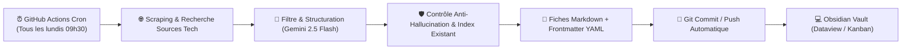

# 📡 Fiche Technique 03 : Agent Veille Événementielle Tech dans Obsidian

> **Destination dans le Vault :** Dossier `04. Veille` (synchronisation continue via Obsidian Git).  
> **Rôle d'Émilie :** Conception du pipeline CI/CD automatisé, logique d'extraction et intégration dans l'écosystème de connaissances Obsidian.

---

## 🎯 1. Objectif & Impact Métier
Automatiser la veille hebdomadaire des conférences, salons et hackathons IA/Tech mondiaux et français pour l'équipe du Lab. Le système fonctionne **100 % dans le cloud sans exiger d'ordinateur allumé**, injectant des fiches d'événements structurées directement exploitables pour la prospection du Lab (VivaTech, Google Cloud Summit, WAIC Shanghai).

---

## 🛠️ 2. Ce que j'ai Conçu & Développé
- **Orchestration CI/CD Cloud (GitHub Actions) :** Programmation d'un workflow serverless déclenché automatiquement tous les lundis à 09h30 via un cron Linux.
- **Moteur d'Extraction & Normalisation (Gemini 2.5 Flash) :** Analyse du web, extraction des entités clés (dates, lieux, thématiques, format, liens d'inscription) et génération de notes Markdown enrichies de métadonnées YAML.
- **Synchronisation Automatisée du Coffre (Obsidian Git) :** Connexion sécurisée au dépôt GitHub via token d'accès dédié pour commiter et pousser les nouvelles fiches directement dans le coffre d'équipe.
- **Interface de Suivi Dynamique :** Mise en place d'un tableau Kanban interactif et de requêtes Dataview filtrant les événements par statut (*À évaluer, Retenu, Inscription faite, Présence confirmée*), zone géographique et thématique.

---

## 🏗️ 3. Architecture Technique

---

## ⚡ 4. Défis Techniques Résolus (Preuves de Compétence)

| Défi Rencontré | Cause Racine Identifiée | Solution Technique Déployée |
|:---|:---|:---|
| **Redondance d'événements récurrents** | Risque de réinjecter les mêmes conférences d'une semaine sur l'autre. | Création d'un **index unique consolidé** : l'agent consulte l'existant avant toute création et n'ajoute que les nouveaux signaux ou révisions de programme. |
| **Hallucinations de dates / intervenants** | Les modèles génératifs non contraints extrapolent des données non confirmées. | Conditionnement strict du prompt : obligation de citation d'une **URL source active** et vérification de cohérence calendaire. |
| **Gestion des quotas & coûts d'API** | Épuisement rapide des quotas lors des expérimentations initiales sous Claude. | Migration vers **Google Gemini 2.5 Flash** : réduction drastique des coûts d'inférence avec un débit de token largement supérieur. |

---

## 📊 5. Métriques & Résultats
- **Disponibilité :** 100 % autonome dans le cloud (0 intervention manuelle hebdomadaire requise).
- **Consistance de données :** Métadonnées 100 % exploitables par les requêtes Dataview pour la planification des déplacements de l'équipe du Lab.

---

## 🔗 Liens & Références
- [[01 - Projects/Stage OnePoint - AI Lab/Index du Stage|Index général du stage OnePoint]]
- [[02 - Areas/Compétences & R&D IA/Cloud Serverless & Sécurité des Systèmes IA (AWS, Vercel)|Compétence : Cloud & Automatisation]]
- [[02 - Areas/Compétences & R&D IA/Architecture Agentique & Meta-Prompting|Compétence : Meta-Prompting & LLMs]]
