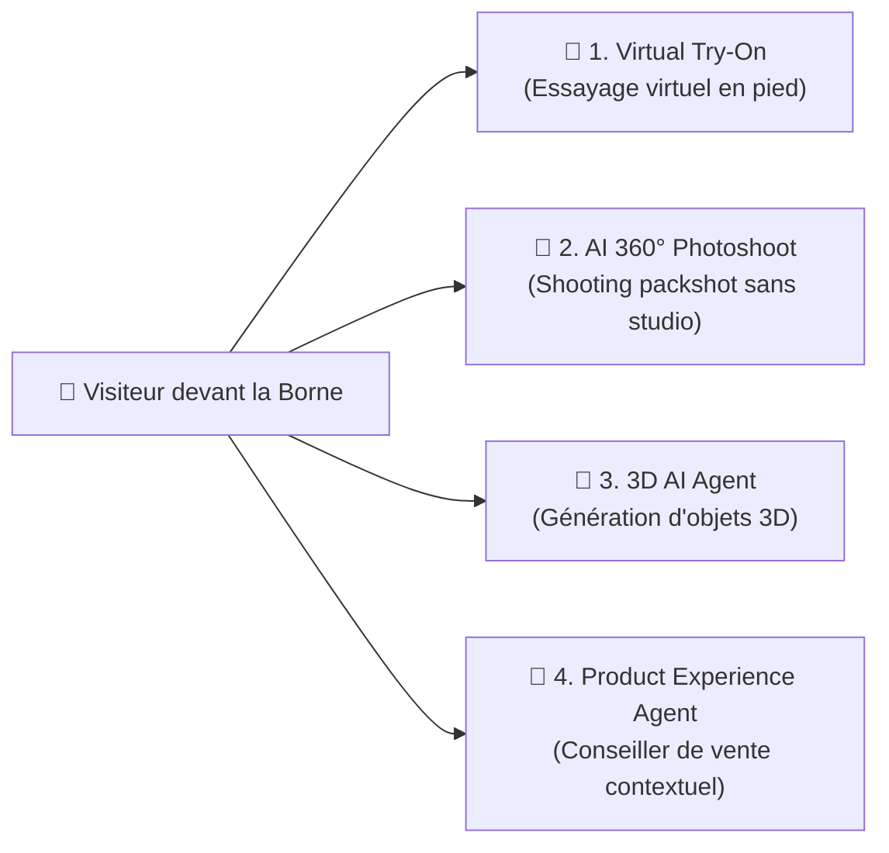

# 🛍️ Fiche Technique 04 : Suite Retail AI & Virtual Try-On

> **Référence Deck Marketing :** Diapositive 35 (*Virtual try on : notre playground expérientiel IA*) & Diapositive 8.  
> **Démonstrateur Déployé :** `https://experiences-retail-ai.vercel.app/demos/virtual-try-on`.

---

## 📌 1. Contexte & Enjeux

Conçue comme une démonstration phare de l'**Agentic Livepoint**, l'application **experiences-retail-ai** permet aux dirigeants du secteur retail et luxe de tester en situation réelle l'impact de l'IA générative sur le parcours d'achat et la personnalisation de la relation client.
L'objectif était de proposer une borne immersive fluide et intuitive où le visiteur se fait photographier, sélectionne des pièces de collection et se voit instantanément porter les vêtements avec un niveau de réalisme adapté au commerce haut de gamme.

---

## 🧩 2. Les 4 Modules de la Suite Retail

1. **Virtual Try-On (Essayage Virtuel) :** Remplacement dynamique de tenues sur mannequin personnalisé respectant la morphologie du visiteur.
2. **AI 360° Photoshoot Agent :** Génération automatique de packshots multi-angles en environnement maîtrisé sans photographe ni studio physique.
3. **3D AI Agent :** Reconstruction et manipulation tridimensionnelle des vêtements et accessoires.
4. **Product Experience Agent :** Assistant conversationnel contextuel capable de croiser le look généré avec les stocks et le panier d'achat.

---

## 🛠️ 3. Défis Techniques & Optimisations UX

| Volet | Problème Détecté | Solution & Amélioration Déployée |
|:---|:---|:---|
| **Ghosting & Double Contour** | Artéfacts visuels sur les bordures des vêtements superposés. | Élargissement du masque de fondu de fusion (*feathering*) et ajout d'un bouton de régénération granulaire en un clic. |
| **Morphologie & Cadrage** | Les mannequins standards ne reflétaient pas la vraie corpulence du visiteur. | Mise en place d'une **capture caméra en pied** avec viseur graphique immersif (repères *"Tête ici"*, *"Pieds ici"*) et passage du décompte de pose de **3s à 5s**. |
| **Gestion du Temps d'Attente** | Latence perçue négativement pendant la génération par les modèles de diffusion. | Implémentation d'un carrousel interactif avec boutons pause présentant les fiches détaillées des pièces (nom, prix, marque, composition). |
| **Expérience Panier** | Tout le look était ajouté d'un bloc sans flexibilité. | Rendu d'un panier interactif permettant la sélection partielle des pièces souhaitées directement depuis l'écran résultat. |

---

## 🔗 Liens & Références
- [[01 - Projects/Stage OnePoint - AI Lab/Index du Stage|Index général du stage OnePoint]]
- [[02 - Areas/Compétences & R&D IA/Product Building IA & Showroom Expérientiel|Fiche de Compétence : Product Building & Showroom]]
- [[02 - Areas/Compétences & R&D IA/IA Multimodale (Audio, Voix, Vidéo, Vision)|Fiche de Compétence : IA Multimodale]]
