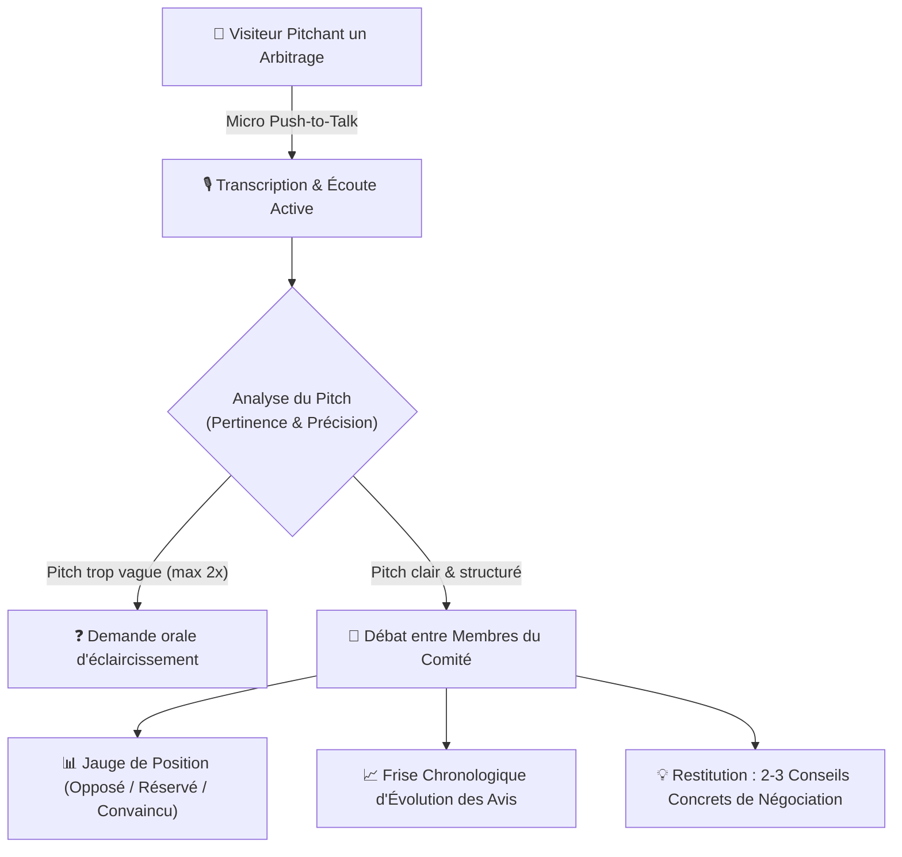
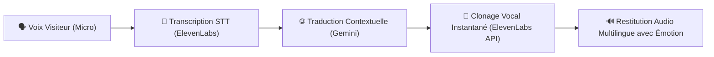

# 🎙️ Fiche Technique 05 : Vocal Playground & Comité Simulé

> **Références Deck Marketing :** Diapositive 37 (*Votre comité simulé … et ce qui lui échappe*) & Diapositive 53 (*Vocal playground : Traduisez votre voix en 11 langues*).  
> **Démonstrateurs Déployés :**
> - Plateforme globale : `https://plateforme-voc.vercel.app/`
> - Expérience Comité Simulé : `https://plateforme-voc.vercel.app/xp/comex-simule`

---

## 📌 1. Contexte & Vision

Le son et la voix incarnent la frontière la plus intime et immédiate de l'IA agentique. Cette suite d'expériences conçue pour le showroom COMEX de l'**Agentic Livepoint** poursuit deux objectifs :
1. **Démontrer la puissance du clonage vocal temps réel** pour la communication internationale des entreprises (Vocal Playground).
2. **Mettre en scène un arbitrage stratégique face à un comité de direction simulé par des agents IA** pour interroger les décideurs sur les forces et limites de la négociation automatisée (Comité Simulé).

---

## 🏛️ 2. Volet 1 : Le Comité Simulé (Comex Virtuel)

### Caractéristiques & Design UI Teams
- **Immersion visioconférence :** Mise en page plein écran sans défilement imitant Microsoft Teams (fond clair, tuiles des participants sombres avec étiquettes de nom et badge de parole réactif).
- **Contrôles physiques :** Bouton microphone en *Push-to-Talk* (maintenir pour parler), levée de main, et bouton rouge pour raccrocher et interrompre net la séance.
- **Dynamique de débat non-linéaire :** Si un argument est déjà traité, les agents changent d'angle plutôt que de répéter la même objection.
- **Sécurisation & Confidentialité :** Le contenu des cas a été assaini directement depuis le coffre Obsidian (retrait des budgets internes, tâches et jargon technique comme « PR » ou « vault », remplacé par « Archiver ce cas au Lab »).

---

## 🌍 3. Volet 2 : Vocal Playground (Doublage Vivant ElevenLabs)

Le visiteur enregistre une phrase au micro et s'entend parler quelques secondes plus tard dans l'une des **11 langues supportées**, en conservant fidèlement son timbre de voix, son débit et ses inflexions émotionnelles.

### Valeur Business démontrée aux clients
- **Internationalisation instantanée :** Diffusion de messages de direction générale à toutes les filiales mondiales sans réenregistrement studio.
- **Réunions multilingues asynchrones :** Briser la barrière de la langue tout en préservant l'authenticité de l'émetteur.

---

## 🔗 Liens & Références
- [[01 - Projects/Stage OnePoint - AI Lab/Index du Stage|Index général du stage OnePoint]]
- [[02 - Areas/Compétences & R&D IA/IA Multimodale (Audio, Voix, Vidéo, Vision)|Fiche de Compétence : IA Multimodale]]
- [[02 - Areas/Compétences & R&D IA/Product Building IA & Showroom Expérientiel|Fiche de Compétence : Product Building & Showroom]]
