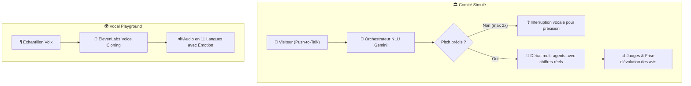

# 🎙️ Fiche Technique 05 : Vocal Playground & Comité Simulé

> **Démonstrateur en Ligne :** `https://plateforme-voc.vercel.app/xp/comex-simule`  
> **Rôle d'Émilie :** Conception de l'interface temps réel façon Teams, intégration des pipelines vocaux ElevenLabs et moteur d'arbitrage multi-agents.

---

## 🎯 1. Objectif & Impact Métier
Créer deux démonstrateurs immersifs pour les directions générales :
1. **Comité Simulé :** Permettre à un dirigeant de pitcher un arbitrage stratégique devant un comité d'agents IA qui débattent, challengent et votent en temps réel.
2. **Vocal Playground :** Démontrer l'internationalisation instantanée en traduisant et en clonant la voix du visiteur en **11 langues** tout en préservant son timbre et ses émotions.

---

## 🛠️ 2. Ce que j'ai Conçu & Développé
- **Interface Immersive Type Microsoft Teams :** Conception d'une grille réactive plein cadre sans défilement avec fond clair, tuiles sombres, badge d'interlocuteur actif synchronisé au millième de seconde et chronomètre de séance.
- **Contrôles Audio Push-to-Talk :** Implémentation via la *Web Audio API* d'une commande micro « maintenir pour parler », levée de main et bouton d'interruption d'urgence (raccrochage net).
- **Moteur d'Arbitrage & Visualisation Dynamique :**
  - Jauge de conviction trichrome dynamique (*rouge = opposé, gris = réservé, bleu = convaincu*).
  - Frise chronologique vectorielle reliant les pastilles d'évolution des positions des membres du comité au fil des arguments.
- **Pipeline de Clonage Instantané :** Chaîne audio *Capture Micro ➔ Transcription STT ElevenLabs ➔ Traduction sémantique Gemini ➔ Clonage vocal instantané ElevenLabs ➔ Restitution multilingue synchrone*.

---

## 🏗️ 3. Architecture Technique

---

## ⚡ 4. Défis Techniques Résolus (Preuves de Compétence)

| Défi Rencontré | Cause Racine Identifiée | Solution Technique Déployée |
|:---|:---|:---|
| **Agents débattant dans le vide** | Si le pitch du visiteur manquait de substance, les agents tournaient en boucle. | Programmation d'un **garde-fou conversationnel** : le comité coupe la parole poliment pour exiger une précision concrète (max 2 fois). |
| **Désynchronisation audio / interface** | La tuile de l'agent qui parlait s'allumait avec plusieurs secondes de retard. | Refonte de la gestion d'état réactive : latence d'annonce d'intervention **réduite de 20s à moins de 2s**. |
| **Répétition stérile d'arguments** | Les agents reprenaient parfois les mêmes objections. | Injection d'une fonction de changement d'angle : obligation pour l'agent reprenant la parole d'aborder un nouveau point de vue. |
| **Sécurisation des données internes** | Le contenu initial contenait des données budgétaires confidentielles du Lab. | Assainissement intégral des cas d'usage depuis le vault Obsidian (suppression des coûts réels et du jargon interne comme « PR » ou « vault »). |

---

## 📊 5. Métriques & Résultats
- **Langues prises en charge :** 11 langues traduites avec le timbre vocal exact de l'utilisateur.
- **Fluidité de séance :** 100 % d'immersion sans latence perceptible entre la prise de parole et l'actualisation des jauges visuelles.

---

## 🔗 Liens & Connexions Graphe
- [[01 - Projects/Stage OnePoint - AI Lab/Index du Stage|Index général du stage OnePoint]]
- [[01 - Projects/Stage OnePoint - AI Lab/Fiches Techniques/FT01 - Agent Video Propale Remotion Lambda|FT01 — Agent Vidéo Propale (Moteur Audio ElevenLabs)]]
- [[01 - Projects/Stage OnePoint - AI Lab/Fiches Techniques/FT08 - Multimodal Rokid x Reachy|FT08 — Projet Multimodal : Rokid x Reachy]]
- [[02 - Areas/Compétences & R&D IA/IA Multimodale (Audio, Voix, Vidéo, Vision)|Compétence : IA Multimodale]]
- [[02 - Areas/Compétences & R&D IA/Architecture Agentique & Meta-Prompting|Compétence : Architecture Agentique (Comité Simulé)]]
- [[02 - Areas/Compétences & R&D IA/Product Building IA & Showroom Expérientiel|Compétence : Product Building & Showroom]]
- [[03 - Resources/MOC - Carte des Connaissances & Graphe|🗺️ MOC — Carte des Connaissances & Graphe]]
