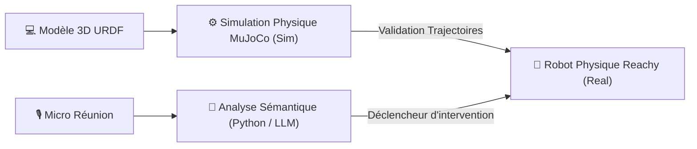

# 🤖 Fiche Technique 06 : Reachy Mini — Robotique & Simulation MuJoCo

> **Hardwares & Partenaires :** Pollen Robotics x Hugging Face.  
> **Rôle d'Émilie :** Assemblage matériel physique, modélisation/simulation 3D sous MuJoCo et développement des algorithmes de modération en Python.

---

## 🎯 1. Objectif & Impact Métier
Explorer l'incarnation physique de l'IA (*Embodied AI*) à travers un robot humanoïde de table capable d'animer et de modérer activement des réunions professionnelles. Contrairement aux assistants virtuels passifs, Reachy combine gestuelle expressive, regard orienté et interventions vocales à haute valeur ajoutée.

---

## 🛠️ 2. Ce que j'ai Conçu & Développé
- **Assemblage Matériel Physique :** Montage mécanique complet du robot Reachy Mini (servomoteurs, bus de communication, tête articulée et caméras).
- **Simulation Physique 3D (MuJoCo) :** Modélisation cinématique et dynamique sous le moteur physique MuJoCo à partir des fichiers géométriques URDF / XML pour valider les trajectoires sans risque de casse matérielle.
- **Logique d'Agent « Silence par Défaut » :** Programmation d'un comportement d'écoute active où le robot reste silencieux par défaut et n'intervient à voix haute qu'en **une ou deux phrases percutantes** selon 4 déclencheurs précis :
  1. *Relance inclusive :* Invitation bienveillante d'un participant silencieux.
  2. *Parking lot :* Recadrage poli d'un hors-sujet avec proposition de le noter pour plus tard.
  3. *Déblocage de débat :* Proposition d'un angle neuf quand les idées tournent en boucle.
  4. *Synthèse des décisions :* Attribution claire des actions à la fin du créneau.

---

## 🏗️ 3. Architecture Technique

---

## ⚡ 4. Défis Techniques Résolus (Preuves de Compétence)

| Défi Rencontré | Cause Racine Identifiée | Solution Technique Déployée |
|:---|:---|:---|
| **Risque de casse mécanique** | Les commandes motrices directes risquaient de dépasser les butées physiques des articulations. | **Validation préalable complète sous MuJoCo** de l'ensemble des limites angulaires et des vitesses avant tout téléversement physique (*Sim-to-Real*). |
| **Intrusivité de l'assistant** | Un agent qui parle constamment pollue la réunion et crée du rejet chez les participants. | Règle algorithmique stricte de **silence par défaut** conditionné par une analyse du niveau de divergence de la discussion. |

---

## 🔗 Liens & Connexions Graphe
- [[01 - Projects/Stage OnePoint - AI Lab/Index du Stage|Index général du stage OnePoint]]
- [[01 - Projects/Stage OnePoint - AI Lab/Fiches Techniques/FT07 - Lunettes IA Rokid Glasses et Wearables|FT07 — Lunettes AR Rokid Glasses]]
- [[01 - Projects/Stage OnePoint - AI Lab/Fiches Techniques/FT08 - Multimodal Rokid x Reachy|FT08 — Projet Multimodal : Rokid x Reachy]]
- [[02 - Areas/Profil & Carrière/Projets Phares & Recherche|Projets Phares : Sealy Robot Compagnon]]
- [[02 - Areas/Compétences & R&D IA/Robotique Incarnée & Informatique Ambiante (Reachy, Rokid, MuJoCo)|Compétence : Robotique Incarnée & MuJoCo]]
- [[03 - Resources/MOC - Carte des Connaissances & Graphe|🗺️ MOC — Carte des Connaissances & Graphe]]
