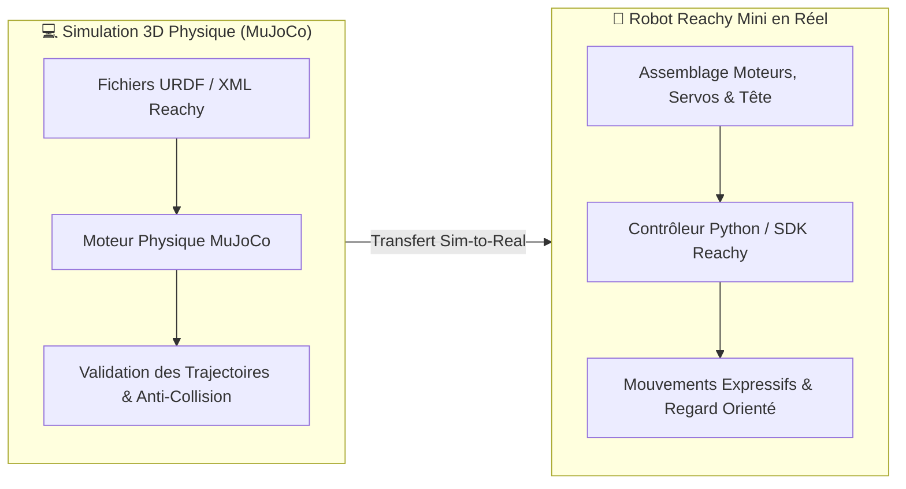

# 🤖 Fiche Technique 06 : Reachy Mini — Robotique & Simulation MuJoCo

> **Référence Deck Marketing :** Diapositive 48 (*Reachy : l'agent qui anime vos réunions et fait avancer le débat*).  
> **Partenaires & Écosystème :** Pollen Robotics x Hugging Face.

---

## 📌 1. Contexte & Démarche d'IA Incarnée

Dans les visions traditionnelles, les agents IA restent confinés à des fenêtres de chat textuelles. Avec **Reachy Mini**, l'objectif du Lab IA était d'explorer le passage de l'IA logicielle à l'**IA incarnée (Embodied AI)** capable d'interagir physiquement dans un espace partagé avec des humains.
Émilie a assuré l'**assemblage matériel physique** du robot ainsi que sa **modélisation et simulation cinématique sous MuJoCo**, avant de développer son comportement d'agent modérateur de réunion.

---

## 🏗️ 2. Double Approche : Virtuelle & Physique

---

## 🎙️ 3. Rôle de l'Agent : Le Modérateur Silencieux

Contrairement à un assistant bavard, Reachy a été programmé avec une posture de **silence par défaut** :
- **Écoute continue & Transcription :** L'agent suit les échanges de la réunion sans interrompre les participants.
- **Interventions à fort impact :** Il n'intervient à voix haute que dans 4 cas précis, toujours en **une ou deux phrases percutantes** :
  1. *Relance des silencieux :* Sollicite bienveillamment un participant qui ne s'est pas exprimé depuis longtemps.
  2. *Recadrage des hors-sujets :* Propose poliment de « parker » une discussion dérivée pour recentrer sur l'ordre du jour.
  3. *Déblocage de débat :* Propose une reformulation synthétique ou un nouvel angle quand les avis tournent en rond.
  4. *Convergence vers l'action :* Résume les décisions et attribue les prochains pas concrets à la fin du créneau.

---

## ⚙️ 4. Stack & Compétences Clés

- **Langage & Environnement :** Python 3, PyTorch, Hugging Face Hub.
- **Simulation Physique :** Moteur **MuJoCo** (modélisation de la gravité, des inerties, des limites angulaires des servomoteurs).
- **Audio & NLU :** Détection d'activité vocale (VAD), diarisation des locuteurs, analyse sémantique via LLM pour repérer les moments de divergence.

---

## 🔗 Liens & Références
- [[01 - Projects/Stage OnePoint - AI Lab/Index du Stage|Index général du stage OnePoint]]
- [[02 - Areas/Compétences & R&D IA/Robotique Incarnée & Informatique Ambiante (Reachy, Rokid, MuJoCo)|Fiche de Compétence : Robotique & MuJoCo]]
- [[01 - Projects/Stage OnePoint - AI Lab/Fiches Techniques/FT08 - Multimodal Rokid x Reachy|FT08 : Projet Multimodal Rokid x Reachy]]
