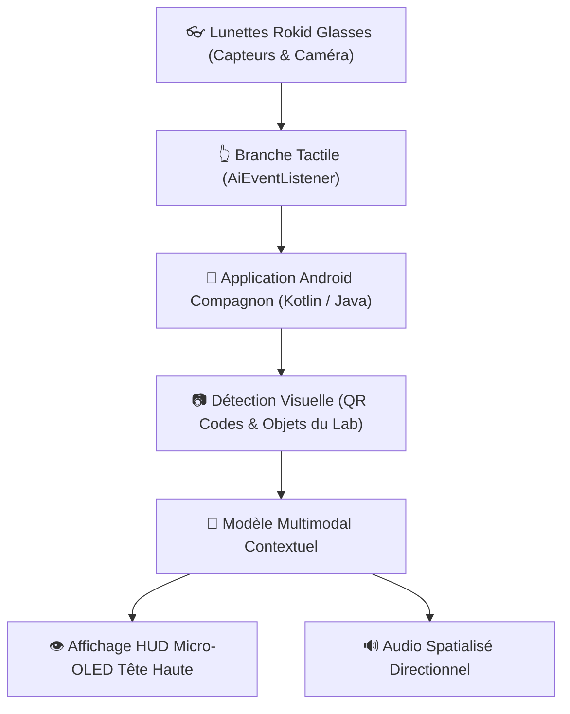

# 👓 Fiche Technique 07 : Lunettes IA Rokid Glasses & Informatique Ambiante

> **Références Deck Marketing :** Diapositive 44 (*Le form factor : capter le contexte pour gagner en pertinence*) & Diapositive 45 (*Visite assistée : Place à la "Meta Information"*).  
> **Hardwares Exploités :** Lunettes IA Rokid Glasses with Display (HUD micro-OLED) + Montre connectée enfant Huawei.

---

## 📌 1. Contexte & Enjeux

L'informatique ambiante cherche à effacer les écrans traditionnels pour intégrer l'intelligence artificielle au plus près de la perception humaine.
Dans cette expérimentation menée au Lab, l'enjeu était d'éprouver ce que les différents formats matériels (*form factors*) captent réellement de notre contexte (regard, voix, gestes, géolocalisation, orientation) et comment restituer une **« Méta-Information »** augmentée en direct sans rompre l'attention de l'utilisateur.

---

## 🏗️ 2. Architecture Logicielle & SDK

---

## 🚀 3. Réalisations & Fonctionnalités Développées

1. **Visite Augmentée du Lab Onepoint (Meta-Information) :**
   - Le visiteur explore l'espace physique du Lab.
   - En fixant un démonstrateur ou un QR code contextuel, les lunettes projettent instantanément une fiche synthétique dans son champ de vision et déclenchent une explication vocale personnalisée dans les branches audio.
2. **Contrôle Gestuel & Tactile via la Branche :**
   - Implémentation du composant d'écoute tactile `AiEventListener` sur la branche des lunettes pour défiler, valider ou congédier une information sans avoir à sortir un smartphone.
3. **Interface de Slicer Visuel Vertical :**
   - Conception d'un menu de navigation vertical optimisé pour la surface d'affichage tête haute, synchronisé avec un curseur interactif (*SeekBar*) sur le smartphone compagnon.
4. **Croisement de Données Ambiantes :**
   - Expérimentation conjointe avec une montre connectée pour croiser la géolocalisation, les micros ambiants et les données biométriques simples.

---

## 🔗 Liens & Références
- [[01 - Projects/Stage OnePoint - AI Lab/Index du Stage|Index général du stage OnePoint]]
- [[02 - Areas/Compétences & R&D IA/Robotique Incarnée & Informatique Ambiante (Reachy, Rokid, MuJoCo)|Fiche de Compétence : Ambiance & Wearables]]
- [[01 - Projects/Stage OnePoint - AI Lab/Fiches Techniques/FT08 - Multimodal Rokid x Reachy|FT08 : Projet Multimodal Rokid x Reachy]]
