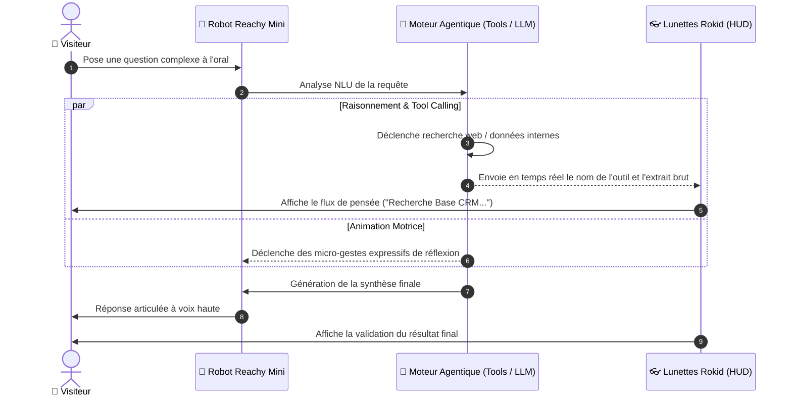

# 👁️‍🗨️ Fiche Technique 08 : Projet Multimodal Rokid x Reachy — « Dans la tête de l'Agent »

> **Référence Deck Marketing :** Diapositive 52 (*Dans la tête de l'Agent : voir une IA penser en direct*).  
> **Type de Projet :** Démonstrateur immersif combinant Robotique physique et Affichage tête haute AR.

---

## 📌 1. Contexte & Intention Pédagogique

Pour la majorité des décideurs d'entreprise, le fonctionnement d'une IA reste une « boîte noire » : on entre un prompt, on attend quelques secondes, et une réponse apparaît sans qu'on comprenne d'où elle provient ni quels outils ont été sollicités.
L'expérience **« Dans la tête de l'Agent »** brise cette opacité en créant un pont technique direct entre le robot **Reachy Mini** et les **lunettes connectées Rokid**.

---

## 🔄 2. Parcours Utilisateur & Scénario Immersif

---

## ⚙️ 3. Architecture Technique de Synchronisation

1. **Serveur d'Orchestration Local (Agent Host) :**
   - Écoute les requêtes audio via le micro de Reachy.
   - Orchestre le modèle de raisonnement (Tool-calling : météo, recherche documentaire, bases internes).
2. **Flux WebSocket Bidirectionnel :**
   - Stream en quasi temps réel (< 80 ms de latence) des événements d'exécution (*Thinking steps*, *Tool invocation*, *Observation*, *Final answer*) vers l'application Android des lunettes.
3. **Moteur de Rendu Head-Up Display (Rokid HUD) :**
   - Affichage graphique épuré et contrasté (vert néon / blanc sur fond transparent) pour rester lisible en surimpression de la pièce réelle sans gêner la vision de l'interlocuteur.

---

## 💎 4. Valeur Démontrée aux Clients du Lab

- **Explicabilité totale (XAI) :** Comprendre instantanément la différence entre une simple réponse statistique et un véritable raisonnement agentique multi-outils.
- **Transparence et confiance :** Identifier la source exacte de chaque chiffre ou affirmation émise par l'agent.

---

## 🔗 Liens & Références
- [[01 - Projects/Stage OnePoint - AI Lab/Index du Stage|Index général du stage OnePoint]]
- [[01 - Projects/Stage OnePoint - AI Lab/Fiches Techniques/FT06 - Reachy Mini Robotique et MuJoCo|FT06 : Robot Reachy Mini]]
- [[01 - Projects/Stage OnePoint - AI Lab/Fiches Techniques/FT07 - Lunettes IA Rokid Glasses et Wearables|FT07 : Lunettes Rokid Glasses]]
