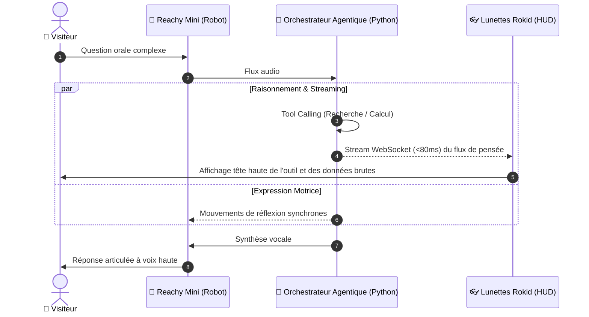

# 👁️‍🗨️ Fiche Technique 08 : Multimodal Rokid x Reachy — « Dans la tête de l'Agent »

> **Démonstrateur Flagship du Lab :** Expérience combinant Robotique humanoïde et Réalité Augmentée.  
> **Rôle d'Émilie :** Conception de l'architecture de synchronisation multimodale, protocole WebSocket temps réel et affichage de l'IA explicable (*XAI*).

---

## 🎯 1. Objectif & Impact Métier
Démystifier la « boîte noire » de l'intelligence artificielle pour les dirigeants : pendant que le robot **Reachy Mini** réfléchit et répond à voix haute à un problème complexe, l'observateur équipé des **lunettes Rokid** voit s'afficher en direct dans son champ de vision la chaîne de raisonnement exacte de l'agent (*Reasoning Trace*) et les outils qu'il mobilise.

---

## 🛠️ 2. Ce que j'ai Conçu & Développé
- **Protocole de Synchronisation Événementiel (WebSockets) :** Développement d'un bus de communication ultra-rapide reliant le runtime Python de Reachy et l'application Android des lunettes Rokid.
- **Moteur d'Extraction de Trace de Raisonnement (XAI) :** Capture et filtrage temps réel des événements d'exécution du LLM (*Appel d'outil web, interrogation base interne, observation, synthèse*).
- **Rendu Tête Haute Réactif :** Affichage HUD optimisé sur micro-OLED transparent matérialisant visuellement les étapes de pensée au fur et à mesure que le robot s'anime.

---

## 🏗️ 3. Architecture Technique

---

## ⚡ 4. Défis Techniques Résolus (Preuves de Compétence)

| Défi Rencontré | Cause Racine Identifiée | Solution Technique Déployée |
|:---|:---|:---|
| **Latence entre la parole et l'affichage** | Un décalage entre les gestes du robot et l'affichage HUD brisait la sensation de simultanéité. | Implémentation d'un **serveur WebSocket local léger** maintenant la latence sous la barre des **80 millisecondes**. |
| **Surcharge cognitive dans le HUD** | Le flux de tokens brut du modèle était illisible pour un humain en direct. | Conception d'un **filtre sémantique en amont** ne transmettant que les états discrets (*"Recherche base CRM"*, *"Vérification calendrier"*, *"Validation"*). |

---

## 📊 5. Métriques & Impact
- **Latence de streaming :** **< 80 ms** entre l'appel d'outil serveur et son apparition dans le champ de vision.
- **Impact client :** Démonstrateur le plus marquant du Lab pour faire comprendre la différence entre un chatbot et un système agentique multi-outils.

---

## 🔗 Liens & Références
- [[01 - Projects/Stage OnePoint - AI Lab/Index du Stage|Index général du stage OnePoint]]
- [[01 - Projects/Stage OnePoint - AI Lab/Fiches Techniques/FT06 - Reachy Mini Robotique et MuJoCo|FT06 — Reachy Mini]]
- [[01 - Projects/Stage OnePoint - AI Lab/Fiches Techniques/FT07 - Lunettes IA Rokid Glasses et Wearables|FT07 — Lunettes Rokid]]
