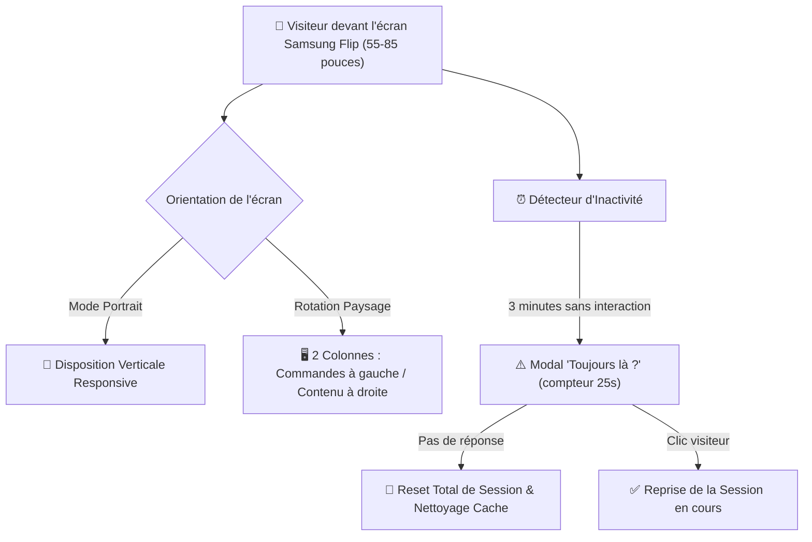

# 🖥️ Fiche Technique 09 : Generic Showroom Experience — Agentic Livepoint

> **Démonstrateur Déployé :** `https://live-onepoint-git-generic-show-e4035a-aitools-projects-9ec7e8a3.vercel.app/`  
> **Dépôt Git :** `live-onepoint` (Branche `generic-showroom-experience`).  
> **Hardwares Cibles :** Écrans tactiles interactifs **Samsung Flip** (55 à 85 pouces) installés en libre-service dans le showroom du Lab.

---

## 📌 1. Contexte & Mission

Initialement développée pour un cas client spécifique (BNP Paribas), l'application interactive `live-onepoint` a été entièrement refondue par Émilie pour devenir le **socle universel de démonstration tactile en libre-service** de l'Agentic Livepoint.
Ce projet englobe l'accueil du showroom ainsi que deux expériences collaboratives majeures : **Virtual Panel** et **Smart Collab**.

---

## 🎨 2. Direction Artistique AI.LAB & Ergonomie Showroom

Pour rompre avec les interfaces génériques, une nouvelle charte visuelle exclusive a été conçue et déployée sur l'ensemble des écrans :
- **Identité chromatique :** Fond crème chaleureux parcouru de fines lignes ondulées vectorielles, titres en majuscules avec dégradé subtil, et bandeaux secondaires en typographie monospace.
- **Typographie universelle :** Poppins adoptée sur tous les composants pour une lisibilité optimale à distance.
- **Navigation chapeau :** Logo AI.LAB interactif en haut à gauche permettant de revenir à la mosaïque centrale des démonstrateurs à tout moment.

---

## 📱 3. Adaptabilité Samsung Flip & Robustesse Kiosque

### Mécanismes Développés :
1. **Responsive Multi-Format (55" à 85") :** Adaptation dynamique en direct lors de la rotation de l'écran Samsung Flip (passage fluide d'une colonne verticale à deux colonnes ergonomiques en paysage).
2. **Système de Nettoyage Automatique de Borne :**
   - Surveillance de l'inactivité utilisateur : au bout de 3 minutes, affichage d'un avertissement de 25 secondes (*"Toujours là ?"*).
   - En l'absence de clic, réinitialisation intégrale de l'état, purge des données temporaires et retour à l'écran d'accueil pour le visiteur suivant.
   - Bouton de réinitialisation manuelle immédiate en haut à droite pour les animateurs du Lab.

---

## 🔒 4. Sécurité & Refonte d'Infrastructure

- **Sécurisation de l'API Google Gemini :** Élimination de toute saisie ou exposition de clé API côté client ; toutes les requêtes sont désormais encapsulées derrière une fonction serverless sécurisée hébergée sur Vercel.
- **Assainissement du Codebase :** Suppression de l'ancien serveur obsolète, purge de l'outil *Data Scout* devenu inutile, et élimination des dépendances et polices superflues pour alléger le bundle initial.

---

## 🔗 Liens & Références
- [[01 - Projects/Stage OnePoint - AI Lab/Index du Stage|Index général du stage OnePoint]]
- [[02 - Areas/Compétences & R&D IA/Product Building IA & Showroom Expérientiel|Fiche de Compétence : Product Building & Showroom]]
- [[02 - Areas/Compétences & R&D IA/Cloud Serverless & Sécurité des Systèmes IA (AWS, Vercel)|Fiche de Compétence : Sécurité & Vercel]]
