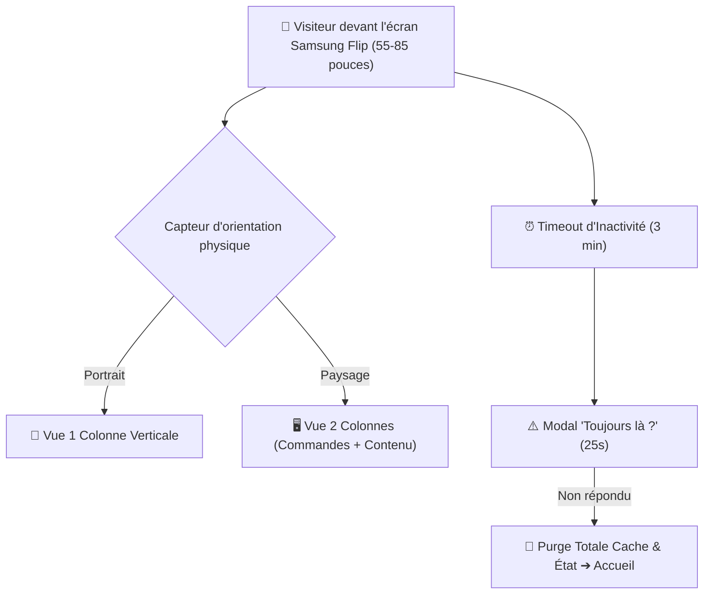

# 🖥️ Fiche Technique 09 : Generic Showroom Experience (Samsung Flip)

> **Application en Production :** `https://live-onepoint-git-generic-show-e4035a-aitools-projects-9ec7e8a3.vercel.app/`  
> **Dépôt Git :** `live-onepoint` (Branche `generic-showroom-experience`).  
> **Rôle d'Émilie :** Refonte frontend Next.js, adaptation matérielle aux écrans Samsung Flip et sécurisation de l'architecture API.

---

## 🎯 1. Objectif & Impact Métier
Transformer une application client unique en un **socle universel et robuste de borne libre-service** pour l'Agentic Livepoint. L'application tourne en continu sur des écrans tactiles interactifs géants (Samsung Flip de 55 à 85 pouces) tout en assurant une réinitialisation automatique et une étanchéité stricte des données entre deux groupes de visiteurs.

---

## 🛠️ 2. Ce que j'ai Conçu & Développé
- **Adaptabilité Matérielle Multi-Format (Samsung Flip) :** Gestion réactive de l'orientation de l'écran en direct (passage automatique d'une colonne en mode portrait à deux colonnes ergonomiques en paysage sur diagonales de 55" à 85").
- **Système de Nettoyage Automatique de Borne (Kiosk Mode) :**
  - Surveillance active de l'inactivité : détection de 3 minutes sans interaction ➔ déclenchement d'un compte à rebours de 25 secondes (*"Toujours là ?"*).
  - En l'absence de clic : réinitialisation intégrale de l'état applicatif, purge du cache local et retour automatique à l'accueil.
  - Bouton physique de reset manuel discret en haut à droite pour les animateurs du Lab.
- **Direction Artistique & Design System AI.LAB :** Déploiement d'un univers visuel complet (fond crème vectoriel ondulé, typographie Poppins, bandeaux monospace, titres dégradés).
- **Sécurisation Cloud de l'API Gemini :** Élimination de toute saisie ou présence de clé API dans le code frontend ; routage de toutes les requêtes via un proxy d'API serverless sur Vercel.

---

## 🏗️ 3. Architecture Technique

---

## ⚡ 4. Défis Techniques Résolus (Preuves de Compétence)

| Défi Rencontré | Cause Racine Identifiée | Solution Technique Déployée |
|:---|:---|:---|
| **Fuite de données entre sessions clients** | Les données saisies par un client restaient visibles pour le visiteur suivant. | Développement d'un **système de reset d'état absolu à double déclenchement** (temporisateur d'inactivité + bouton de purge manuelle). |
| **Exposition de clé API sur borne publique** | L'implémentation originelle demandait une clé côté client. | Encapsulation de l'API Gemini derrière une **fonction serverless Vercel sécurisée** sans exposition du token dans le bundle. |
| **Dette technique & lenteur de chargement** | Présence de code obsolète issu de l'ancien projet (*Data Scout*, polices non utilisées). | Refactoring et nettoyage complet du codebase : réduction substantielle du poids de bundle initial. |

---

## 🔗 Liens & Références
- [[01 - Projects/Stage OnePoint - AI Lab/Index du Stage|Index général du stage OnePoint]]
- [[02 - Areas/Compétences & R&D IA/Product Building IA & Showroom Expérientiel|Compétence : Showroom & Kiosques]]
- [[02 - Areas/Compétences & R&D IA/Cloud Serverless & Sécurité des Systèmes IA (AWS, Vercel)|Compétence : Sécurité & Vercel]]
