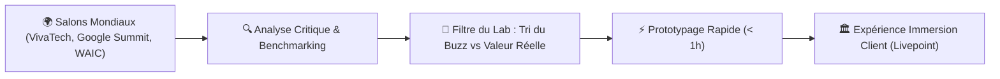

# 🌐 Fiche Technique 10 : Prospection Salons Tech & Curation Livepoint

> **Événements Couverts sur le Terrain :** VivaTech 2026 (Paris), Google Cloud Summit (Paris), World AI Conference — WAIC 2026 (Shanghai).  
> **Rôle d'Émilie :** Veille technologique terrain, benchmark des hyperscalers et curation technique du catalogue de démonstrateurs de l'Agentic Livepoint.

---

## 🎯 1. Objectif & Impact Métier
Identifier les technologies émergentes à l'état de l'art avant leur banalisation industrielle, évaluer leur maturité réelle et les convertir en **démonstrateurs tangibles actionnables en moins de 5 minutes** pour les comités de direction accueillis au Lab.

---

## 🛠️ 2. Ce que j'ai Conçu & Développé
- **Benchmarks Concurrentiels Approfondis :** Analyse comparative des offres agentiques et multimodales des leaders du marché (Google Vertex AI / Astra, Microsoft Azure AI, Anthropic Managed Agents, AWS Bedrock).
- **Formalisation Technique de la « Frontier Firm » :** Définition de l'échelle de délégation humain-agent et modélisation de la rupture économique (passage de la licence par utilisateur à la facturation à la valeur/action).
- **Curation & Prototypage de Cas d'Usage :** Sourcing et cadrage direct de plusieurs expériences phares du catalogue :
  - *La Faille :* Conception du challenge de prompt injection en 8 étapes pour sensibiliser les DSI aux vulnérabilités des agents.
  - *Almorphose :* Intégration du moteur d'art génératif Krea.
  - *Project Astra :* Modélisation de cas d'assistance industrielle en vision multimodale temps réel.

---

## 🏗️ 3. Méthodologie de Curation & Transfert Technologique

---

## ⚡ 4. Preuves d'Expertise Stratégique & Technologique

| Enjeu Clé | Analyse Réalisée | Restitution Opérationnelle au Lab |
|:---|:---|:---|
| **Rupture économique du SaaS traditionnel** | Étude du cas Salesforce début 2026 : perte de 31 % sur le modèle de licence par siège remplacé par le travail agentique. | Intégration de l'argumentaire *Frontier Firm* et conception du simulateur *La Facture* pour aider les clients à chiffrer leur transition. |
| **Sécurisation des architectures agentiques** | Identification de vecteurs d'attaque par injection indirecte de prompt observés lors de la WAIC Shanghai. | Création du simulateur *La Faille* et durcissement des garde-fous sur l'ensemble des agents développés au Lab (Ellis, ScriptWriter). |

---

## 🔗 Liens & Connexions Graphe
- [[01 - Projects/Stage OnePoint - AI Lab/Index du Stage|Index général du stage OnePoint]]
- [[01 - Projects/Stage OnePoint - AI Lab/Catalogue des 20 Expériences de l'Agentic Livepoint|Catalogue des 20 Expériences du Livepoint]]
- [[01 - Projects/Stage OnePoint - AI Lab/Fiches Techniques/FT03 - Agent Veille Tech Obsidian|FT03 — Agent Veille Tech]]
- [[01 - Projects/Stage OnePoint - AI Lab/Fiches Techniques/FT09 - Generic Showroom Experience Livepoint|FT09 — Generic Showroom Experience]]
- [[02 - Areas/Compétences & R&D IA/Product Building IA & Showroom Expérientiel|Compétence : Product Building]]
- [[03 - Resources/Vision Frontier Firm & Organisation Agentique|Fiche Concept : Vision Frontier Firm]]
- [[03 - Resources/MOC - Carte des Connaissances & Graphe|🗺️ MOC — Carte des Connaissances & Graphe]]
