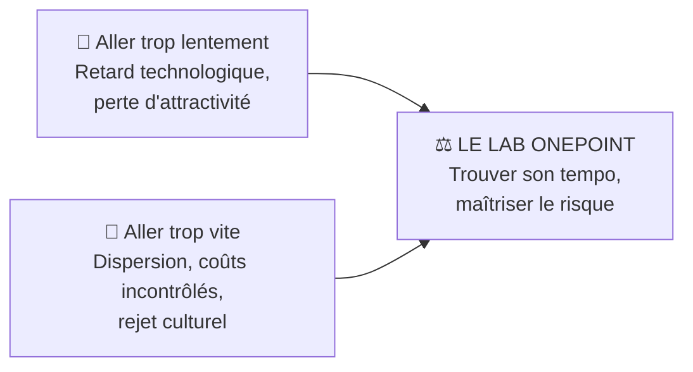
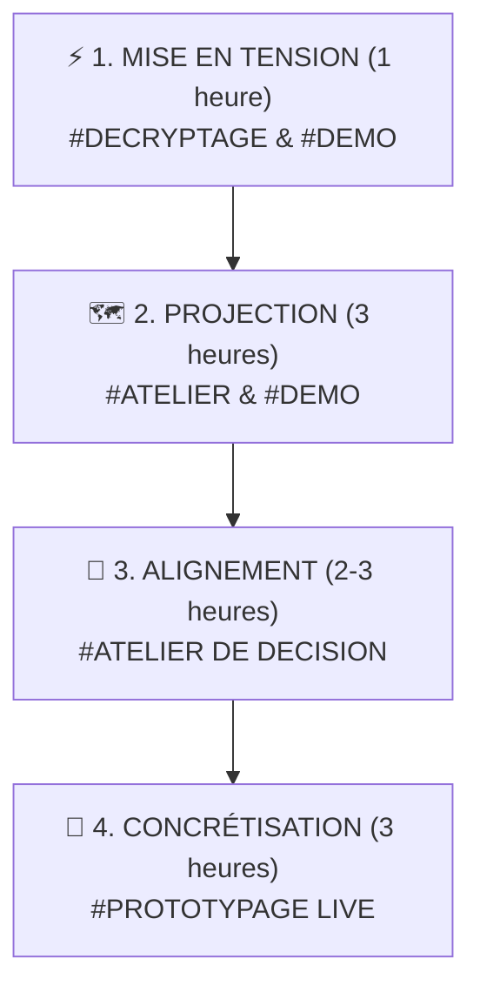

# 🎯 Offre & Parcours Client — Agentic Livepoint

> **Source :** `[AI LAB] Deck marketing de l'agentique livepoint V2.pptx` (Slides 13–25 & 73–78).  
> **Plateforme de Réservation Dédiée :** `https://agentic-lab-booking.lovable.app`.  
> **Format Type :** Groupes de 12 décideurs maximum (COMEX, DSI, Directeurs Métiers).

---

## 🧭 1. La Promesse du Lab : Trouver son « Bon Tempo »

L'Agentic Livepoint n'est pas une simple salle de démonstration logicielle : c'est un **atelier d'acculturation, d'arbitrage et de concrétisation** destiné aux directions générales.

---

## 🪜 2. Le Parcours en 4 Temps

Le catalogue d'accompagnement structure la découverte de l'agentique à travers 4 modules cumulables et personnalisables :

### ⏱️ Temps 1 : Mise en Tension (1h)
- **Objectif :** Décrypter ce que la rupture agentique change concrètement pour le secteur du client.
- **Déroulé :**
  - *20 min :* Les grandes tendances de fond (shift du LLM assistant vers l'agent autonome).
  - *25 min :* Les signaux faibles sectoriels et l'urgence compétitive.
  - *15 min :* 3 démonstrations immersives ciblées (ex: Deepfake, Break the Bocal).
- **Livrable :** *Synthèse des mandats stratégiques*.

### ⏱️ Temps 2 : Projection (3h)
- **Objectif :** Cartographier les cas d'usage agentiques sur la chaîne de valeur du client.
- **Déroulé :**
  - *30 min :* La chaîne de valeur métier posée au mur, étape par étape.
  - *60 min :* Cartographie et scoring des cas d'usage (Axe Valeur Métier vs Faisabilité Technique).
  - *30 min :* Sélection de 3 à 5 cas prioritaires avec désignation de leurs porteurs internes.
- **Livrable :** *Mapping exhaustif des cas d'usage sur la chaîne de valeur*.

### ⏱️ Temps 3 : Alignement (2 à 3h)
- **Objectif :** Résoudre les divergences de vision et fixer une cible commune.
- **Déroulé :**
  - *30 min :* Chaque décideur formule sa cible idéale et ses contraintes opérationnelles/budgétaires.
  - *60 min :* Les arbitrages et divergences sont tranchés directement en séance.
  - *30 min :* Formalisation et validation à voix haute de la cible partagée.
- **Livrable :** *Charte d'alignement et priorités stratégiques validées*.

### ⏱️ Temps 4 : Concrétisation (3h)
- **Objectif :** Transformer le chantier prioritaire en feuille de route chiffrée et en prototype fonctionnel.
- **Déroulé :**
  - *45 min :* Cadrage fin du cas d'usage prioritaire avec les porteurs métier.
  - *90 min :* **Prototypage live** sur des données d'exemple réelles de l'entreprise (*Agentic App Workshop*).
  - *45 min :* Élaboration de la feuille de route opérationnelle à 90 jours (chiffrée et datée).
- **Livrable :** *Prototype testable + Roadmap 90 jours*.

---

## 🎯 3. Les 4 Cibles Métiers Adressées

1. **COMEX / Directions Générales :** Gouvernance, modèle économique, repositionnement de la frontière humain-agent, gestion des talents.
2. **DSI & Équipes Techniques :** Sécurité, prévention des fuites de données (*La Faille*), maîtrise de la facture de tokens (*La Facture*), urbanisation logicielle.
3. **R&D & Innovation :** Exploration de nouveaux formats matériels (*Reachy Mini, Lunettes Rokid*), tests de modèles SOTA multimodaux.
4. **Marketing & Lignes de Métier :** Personnalisation client (*Retail Try-On*), production vidéo accélérée (*ScriptWriter*), animation d'équipes.

---

## 🌐 4. Écosystème de Partenaires Technologiques

L'Agentic Livepoint démontre la valeur des solutions en toute indépendance grâce à des partenariats actifs :
- **Microsoft :** Azure OpenAI Service, Copilot Studio, modèles de frontière.
- **Anthropic :** Famille Claude 3.5 Sonnet / Opus, Managed Agents.
- **Google :** Gemini 2.5/3.1, Vertex AI, Project Astra, Google Cloud.
- **AWS :** Amazon Bedrock, infrastructure serverless Lambda/S3.
- **OpenAI :** GPT-4o, Realtime Voice API, Assistants.
- **Mistral AI :** Le Chat, modèles open-weight et souverains.
- **Écosystème spécialisé :** ElevenLabs (audio/voix), fal.ai (vidéo/image Kling & Seedream), Pollen Robotics (robotique Reachy), Rokid (smart glasses).

---

## 🔗 Liens & Références
- [[01 - Projects/Stage OnePoint - AI Lab/Index du Stage|Index général du stage OnePoint]]
- [[01 - Projects/Stage OnePoint - AI Lab/Catalogue des 20 Expériences de l'Agentic Livepoint|Catalogue des 20 Expériences du Livepoint]]
- [[03 - Resources/Vision Frontier Firm & Organisation Agentique|Fiche : Vision Frontier Firm]]
