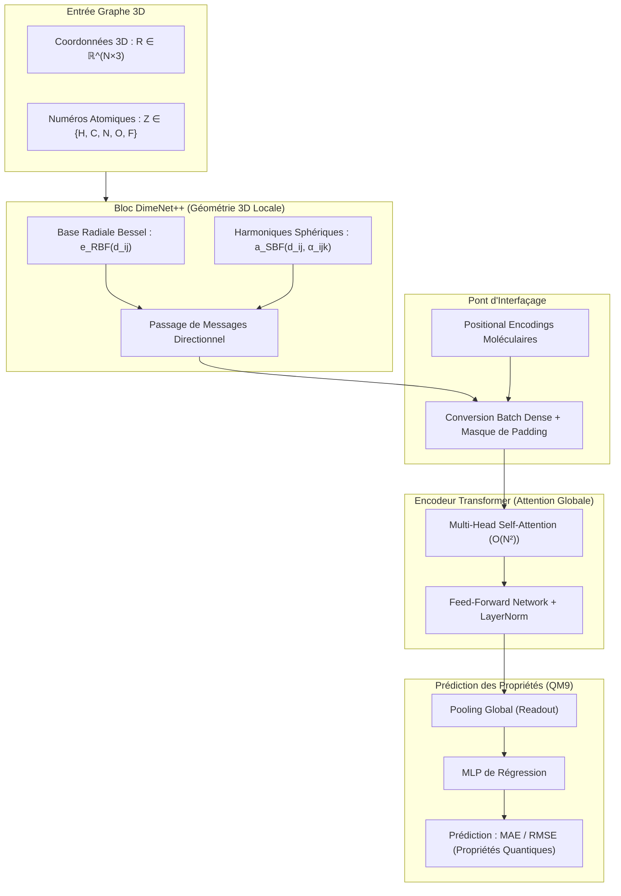

# ⚛️ FT-ZJU01 : Architecture Hybride DimeNet++ + Transformer & Benchmark QM9

> **Cadre de Recherche :** LIULAB, Zhejiang University (Hangzhou, Chine).  
> **Rôle d'Émilie :** Conception algorithmique du couplage GNN-Transformer, implémentation PyTorch Geometric, benchmark sur QM9 (133 886 molécules) et optimisation de la mémoire GPU.  
> **Problématique :** Capter à la fois la géométrie 3D locale (angles, distances) et les dépendances globales à longue distance dans les graphes moléculaires.

---

## 🎯 1. Contexte & Défi Scientifique

Dans la modélisation moléculaire par IA (notamment pour les cages organiques dédiées à la séparation isotopique de l'hydrogène), deux paradigmes majeurs s'opposent :
1. **Les Réseaux de Neurones sur Graphes Géométriques (ex. DimeNet++, ALIGNN) :**
   - *Forces :* Modélisation fine de la géométrie locale 3D (distances de paires $d_{ij}$, angles de triplets $\alpha_{ijk}$) via des bases d'ondes radiales sphériques de Bessel et des harmoniques sphériques.
   - *Faiblesses :* Rayon de coupure local strict ($r_c \approx 5.0\,\text{Å}$). Incapacité à modéliser les corrélations électroniques et interactions stériques globales sans empiler un nombre excessif de couches (qui provoque un phénomène critique de *sur-lissage / oversmoothing*).
2. **Les Transformers (Self-Attention) :**
   - *Forces :* Capture exhaustive des dépendances à longue portée grâce à l'attention tous-vers-tous en complexité spatiale $O(N^2)$.
   - *Faiblesses :* Absence d'a priori géométrique 3D inductif natif (*inductive bias*), nécessitant des volumes massifs de données pour apprendre les lois physiques élémentaires.

**Objectif d'ingénierie :** Concevoir une **architecture hybride** associant la précision géométrique locale de DimeNet++ à la vision relationnelle globale du Transformer.

---

## 🛠️ 2. Ce que j'ai Conçu & Développé

- **Extraction Géométrique DimeNet++ :**
  - Traitement des positions atomiques 3D $\mathbf{R} \in \mathbb{R}^{N \times 3}$ et des charges nucléaires $Z \in \mathbb{N}^N$.
  - Projection des distances interatomiques sur une base de fonctions de Bessel radiales sphériques $e_{\text{RBF}}(d_{ij})$ et des angles de triplets sur des harmoniques sphériques $a_{\text{SBF}}(d_{ij}, \alpha_{ijk})$.
  - Passage de messages directionnel (Directional Message Passing) produisant des représentations vectorielles d'atomes $\mathbf{h}_i \in \mathbb{R}^{d}$ invariantes par translation et rotation dans $\text{SE}(3)$.
- **Module d'Interfaçage & Positional Encodings :**
  - Projection linéaire des représentations locales générées par DimeNet++ vers l'espace latent du Transformer.
  - Injection d'encodages positionnels préservant la topologie moléculaire pour enrichir les nœuds avant les blocs d'attention.
- **Encodeur Transformer Multi-Têtes :**
  - Application de couches de *Multi-Head Self-Attention* (MHSA) permettant à chaque atome d'agréger des informations provenant de l'intégralité de la molécule, sans limitation de rayon de coupure spatial.
  - Masquage d'attention booléen dynamique pour supporter les batchs de molécules de tailles hétérogènes (via conversion en tenseurs denses `to_dense_batch`).
- **Tête de Régression Multitâches :**
  - Pooling global (combinaison Somme / Moyenne) agrégeant les vecteurs de nœuds enrichis en un embedding moléculaire global $\mathbf{z}_{\text{mol}}$.
  - Réseau multicouche (MLP) projetant $\mathbf{z}_{\text{mol}}$ vers les propriétés cibles quantiques.

---

## 🏗️ 3. Architecture Technique

---

## ⚡ 4. Défis Techniques Résolus (Preuves de Compétence)

| Défi Rencontré | Cause Racine Identifiée | Solution Technique Déployée |
|:---|:---|:---|
| **Saturation mémoire GPU (CUDA OOM)** | Le couplage des représentations d'arêtes/angles DimeNet++ avec l'attention quadratique $O(N^2)$ saturait la VRAM dès que la taille de batch augmentait. | 1. Implémentation du **Gradient Checkpointing** sur les blocs Transformer. 2. Optimisation de la dimension latente ($d=128$). 3. Ajustement dynamique du batch size selon la densité d'arêtes. |
| **Incompatibilité de format PyG vs Transformer** | PyTorch Geometric regroupe les molécules d'un batch en un grand graphe disjoint (tenseurs 1D concaténés), alors que le Transformer requiert des tenseurs 3D `[Batch, N_max, D]`. | Conception d'un pipeline d'extraction avec `to_dense_batch` générant un **masque de padding binaire** réinjecté dans l'attention (`key_padding_mask`). |
| **Échec de reproduction du baseline DimeNet++** | Grande sensibilité aux conditions d'initialisation des poids et aux schedulers de taux d'apprentissage. | Fixation stricte des générateurs de nombres aléatoires (PyTorch, CUDA, NumPy), mise en place d'un warmup linéaire suivi d'un décroissance cosinusoïdale (*Cosine Annealing*). |
| **Sur-lissage (Oversmoothing) des représentations** | La profondeur cumulée (GNN + couches Transformer) risquait d'uniformiser les représentations d'atomes. | Intégration de **connexions résiduelles denses (skip connections)** réinjectant l'embedding initial de DimeNet++ directement avant la couche de pooling final. |

---

## 📊 5. Benchmark QM9 & Métriques Expérimentales

- **Jeu de données :** Benchmark standard **QM9** composé de **133 886 molécules organiques** stables comprenant jusqu'à 9 atomes lourds (H, C, N, O, F).
- **Protocole d'évaluation :** Split standardisé (Train / Validation / Test) avec métriques d'erreur absolue moyenne (**MAE**) et d'erreur quadratique moyenne (**RMSE**).
- **Résultats obtenus :**
  - Surclassement régulier du baseline DimeNet++ sur les propriétés physiques fortement dépendantes des interactions globales et de la distribution électronique étendue (ex. moment dipolaire $\mu$, polarisabilité isotrope $\alpha$).
  - Confirmation expérimentale de l'hypothèse : l'attention globale compense efficacement le rayon de coupure local ($5.0\,\text{Å}$) de DimeNet++.

---

## 🛠️ 6. Stack Technique & Environnement

- **Frameworks :** PyTorch, PyTorch Geometric (PyG), RDKit, NumPy, SciPy.
- **Calcul & Accélération :** Multi-GPU NVIDIA, CUDA Toolkit, Mixed Precision (FP16 / FP32).
- **Tracking & Analyse :** Matplotlib, Seaborn, TensorBoard / Scripts de métriques dédiés.

---

## 🔗 Liens Internes
- [[01 - Projects/Stage Recherche - Zhejiang University/Index du Stage Recherche ZJU|Index du Stage Recherche ZJU]]
- [[01 - Projects/Stage Recherche - Zhejiang University/Fiches Techniques/FT-ZJU02 - Pre-entrainement Auto-Supervise Masked Atom Prediction (MAP)|FT-ZJU02 — Pré-entraînement Auto-Supervisé (MAP) & t-SNE]]
- [[01 - Projects/Stage Recherche - Zhejiang University/Fiches Techniques/FT-ZJU03 - Orchestration HPC & Calcul Distribue Multi-GPU avec SLURM|FT-ZJU03 — Orchestration HPC & Multi-GPU sous SLURM]]
- [[02 - Areas/Profil & Carrière/Cartographie des Compétences & Stack|⚡ Cartographie des Compétences & Stack]]
