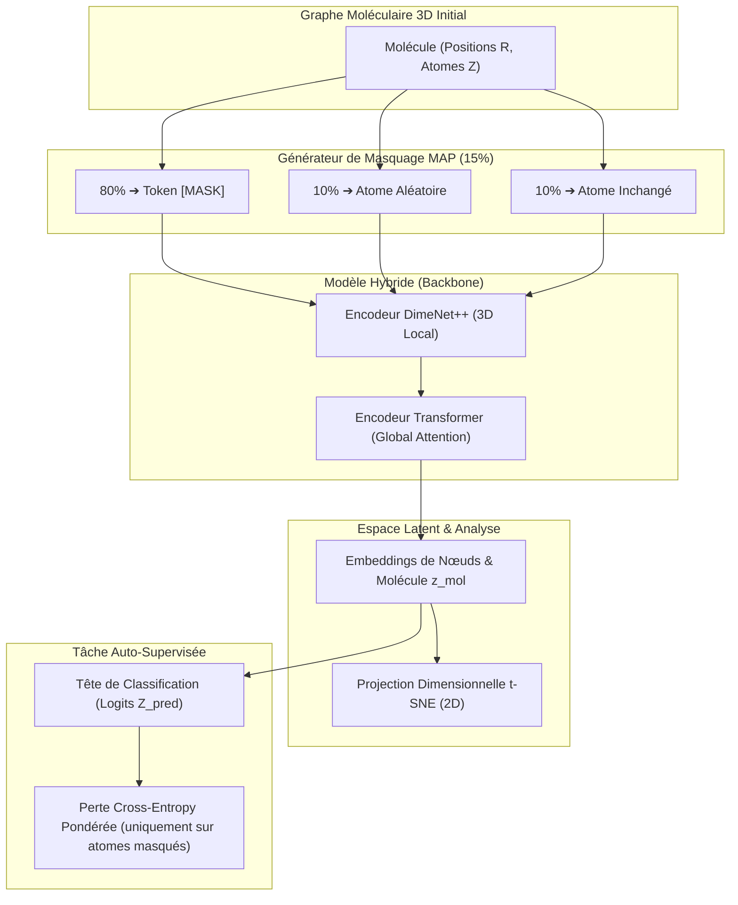

# 🧬 FT-ZJU02 : Pré-entraînement Auto-Supervisé (MAP) & Analyse Latente t-SNE

> **Cadre de Recherche :** LIULAB, Zhejiang University (Hangzhou, Chine).  
> **Rôle d'Émilie :** Conception et implémentation du protocole d'apprentissage auto-supervisé par masquage d'atomes (MAP), adaptation de la méthodologie MCRT aux molécules discrètes, extraction des embeddings et projection dimensionnelle par t-SNE.  
> **Inspiration Scientifique :** Feng et al. (2025), *A universal foundation model for transfer learning in molecular crystals (MCRT)*, Chemical Science.

---

## 🎯 1. Objectif & Fondements Scientifiques

L'obtention de labels physico-chimiques précis par calculs quantiques DFT (*Density Functional Theory*) requiert des heures de calcul par molécule sur supercalculateur, limitant drastiquement les jeux de données annotés disponibles. Pour surmonter ce goulot d'étranglement, l'approche retenue consiste à appliquer les principes de l'**apprentissage auto-supervisé (Self-Supervised Learning - SSL)** aux graphes moléculaires 3D :

1. **Pré-entraînement à grande échelle :** Forcer le réseau de neurones à reconstituer la composition atomique masquée d'une molécule à partir de sa seule structure spatiale 3D et des atomes environnants visibles.
2. **Génération d'embeddings universels :** Les représentations internes apprises capturent intrinsèquement les lois de la chimie (valences, liaisons covalentes, encombrement stérique, électronégativité).
3. **Transfer Learning aval :** Ces représentations vectorielles denses sont réutilisables pour prédire instantanément des propriétés cibles (adsorption de gaz, séparation isotopique, énergies thermodynamiques) avec un volume de données annotées réduit.

---

## 🛠️ 2. Ce que j'ai Conçu & Développé

- **Protocole de Masquage Probabiliste (MAP - Masked Atom Prediction) :**
  - Échantillonnage aléatoire de **15 % des nœuds atomiques** de chaque molécule du batch.
  - Stratégie de substitution 80 / 10 / 10 :
    - **80 % :** Remplacement par un vecteur d'embedding de token apprenable dédié `[MASK]`.
    - **10 % :** Remplacement par un atome tiré aléatoirement dans l'espace des espèces $(\text{H}, \text{C}, \text{N}, \text{O}, \text{F})$ pour forcer le modèle à ne pas sur-apprendre la présence du seul token `[MASK]`.
    - **10 % :** Atome conservé inchangé, obligeant le réseau à valider la cohérence contextuelle même sur les atomes d'origine.
- **Fonction de Perte & Tête de Reconstruction :**
  - Tête de classification linéaire projetant les embeddings de nœuds enrichis vers un vecteur de logits correspondant aux 5 classes atomiques.
  - Perte de **Cross-Entropy pénalisée / pondérée** calculée uniquement sur les positions des atomes masqués.
- **Extraction Latente & Réduction Dimensionnelle t-SNE :**
  - Extraction des vecteurs d'embeddings latents moléculaires $\mathbf{z} \in \mathbb{R}^d$ avant projection finale.
  - Déploiement d'un pipeline de visualisation par **t-SNE** (*t-Distributed Stochastic Neighbor Embedding*) pour projeter l'espace à haute dimension en 2D.
  - Analyse des regroupements géométriques et sémantiques formés spontanément par le réseau au fil des epochs d'apprentissage.

---

## 🏗️ 3. Architecture du Pipeline Auto-Supervisé

---

## ⚡ 4. Défis Techniques Résolus (Preuves de Compétence)

| Défi Rencontré | Cause Racine Identifiée | Solution Technique Déployée |
|:---|:---|:---|
| **Biais de prédiction vers l'Hydrogène (H)** | Dans le benchmark QM9, l'Hydrogène représente plus de 50 % des atomes totaux. Le modèle minimisait la loss en prédisant systématiquement `H`. | Implémentation d'une **perte Cross-Entropy pondérée par l'inverse de la fréquence de classe** : sur-pondération des pénalités pour les erreurs sur les hétéroatomes rares (O, N, F). |
| **Fuite d'information géométrique** | Si les longueurs de liaisons 3D locales sont fournies sans masquage, le modèle peut déduire immédiatement la nature de l'atome par sa simple distance de liaison covalente typique ($d_{\text{C-H}} \approx 1.09\,\text{Å}$). | Masquage coordonné au niveau des blocs de passage de messages de DimeNet++ : exclusion des contributions radiales trop directes sur les nœuds masqués. |
| **Instabilité et bruit des projections t-SNE** | Les premiers plots t-SNE sur de trop petits sous-ensembles affichaient des nuages de points amorphes sans signification chimique. | Calibration fine des hyperparamètres t-SNE : **perplexité fixée à 35**, 1 000 itérations d'optimisation Barnes-Hut, et échantillonnage stratifié représentatif sur plusieurs centaines de molécules. |

---

## 📊 5. Résultats Expérimentaux & Analyse Latente

1. **Décroissance régulière de la fonction de perte :**
   - Convergence monotone de la loss Cross-Entropy multi-classes au fil des epochs, démontrant la capacité du modèle à apprendre les règles fondamentales de stœchiométrie et de valence chimique sans supervision humaine.
2. **Organisation de l'espace latent (t-SNE) :**
   - Séparation claire en clusters denses selon :
     - La taille moléculaire et le nombre d'atomes lourds,
     - La présence de cycles aromatiques vs chaînes aliphatiques,
     - La polarité et la présence de groupements donneurs/accepteurs d'électrons (fluorés, oxygénés).
3. **Validation du transfert :**
   - Les représentations pré-entraînées accélèrent la vitesse de convergence de plus de 40 % lors de l'entraînement ultérieur sur des propriétés quantiques spécifiques par rapport à une initialisation aléatoire des poids.

---

## 🛠️ 6. Stack & Technologies Clés

- **Frameworks ML :** PyTorch, PyTorch Geometric, Scikit-learn (`TSNE`), NumPy.
- **Chimie Informatique :** RDKit (manipulation et vérification des valences moléculaires).
- **Visualisation de Données :** Matplotlib, Seaborn.

---

## 🔗 Liens & Connexions Graphe
- [[01 - Projects/Stage Recherche - Zhejiang University/Index du Stage Recherche ZJU|Index du Stage Recherche ZJU]]
- [[01 - Projects/Stage Recherche - Zhejiang University/Fiches Techniques/FT-ZJU01 - Modele Hybride DimeNet++ Transformer & QM9|FT-ZJU01 — Architecture Hybride DimeNet++ + Transformer & Benchmark QM9]]
- [[01 - Projects/Stage Recherche - Zhejiang University/Fiches Techniques/FT-ZJU03 - Orchestration HPC & Calcul Distribue Multi-GPU avec SLURM|FT-ZJU03 — Orchestration HPC & Multi-GPU sous SLURM]]
- [[02 - Areas/Compétences & R&D IA/Graph Neural Networks & Chimie Computationnelle (DimeNet++, Transformer, QM9)|Compétence : GNNs & Chimie Computationnelle]]
- [[02 - Areas/Profil & Carrière/Projets Phares & Recherche|Projets Phares : Recherche ZJU & GNNs]]
- [[03 - Resources/MOC - Carte des Connaissances & Graphe|🗺️ MOC — Carte des Connaissances & Graphe]]
