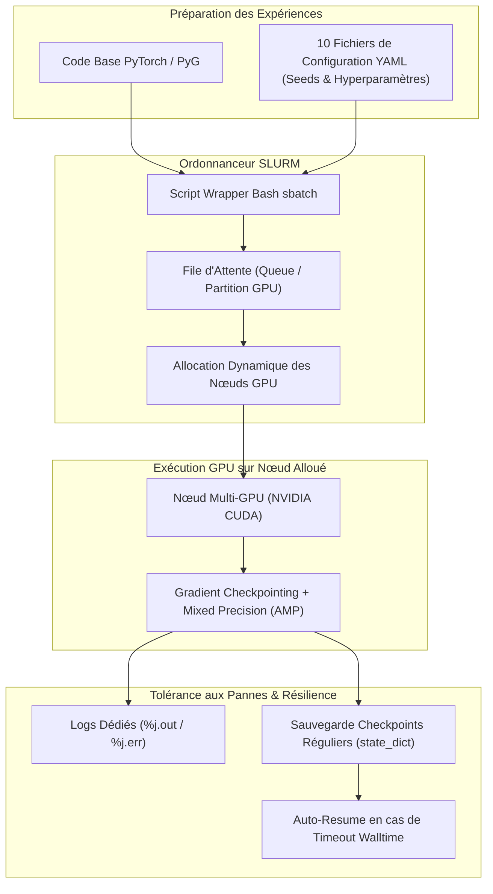

# 💻 FT-ZJU03 : Orchestration HPC & Calcul Distribué Multi-GPU sous SLURM

> **Cadre de Recherche :** LIULAB, Zhejiang University (Hangzhou, Chine).  
> **Rôle d'Émilie :** Architecture et exécution de campagnes d'entraînement distribuées sur supercalculateur, gestion de 10 pipelines parallèles sous SLURM, optimisation VRAM et reproductibilité des runs.  
> **Infrastructure :** Cluster GPU haute performance mutualisé de l'Université du Zhejiang.

---

## 🎯 1. Contexte & Problématique Opérationnelle

L'entraînement de modèles de réseaux de neurones sur graphes géométriques 3D couplés à des encodeurs Transformer (DimeNet++ + Transformer) impose des contraintes extrêmes sur l'infrastructure de calcul :
- **Volume de calcul élevé :** Évaluation sur 133 886 molécules avec calcul exhaustif des angles de triplets et matrices d'attention denses $O(N^2)$.
- **Environnement de supercalculateur partagé :** Ressources GPU mutualisées régies par l'ordonnanceur de tâches **SLURM**, avec files d'attente prioritaires, limites strictes de temps machine (*walltime*) et interruptions potentielles de jobs.
- **Parallélisation massive :** Nécessité d'exécuter jusqu'à **10 configurations expérimentales simultanées** (variations architecturales, ablations, seeds multiples pour validation statistique).

---

## 🛠️ 2. Ce que j'ai Conçu & Développé

- **Gabarit de Soumission Batch SLURM (`#SBATCH`) :**
  - Scripts d'allocation optimisés définissant les ressources matérielles : nombre de nœuds (`--nodes`), GPUs dédiés (`--gres=gpu:1` ou `2`), cœurs processeurs d'alimentation IO (`--cpus-per-task=8`), et mémoire vive hôte (`--mem=32G`).
  - Définition rigoureuse des limites de temps (`--time=48:00:00`) et redirection propre des flux de logs (`--output=logs/%j.out` et `--error=logs/%j.err`).
- **Isolation Environnementale & Reproductibilité :**
  - Configuration d'environnements virtuels Conda / Pip reproductibles avec verrouillage strict des versions binaires compilées (PyTorch 2.x, PyTorch Geometric, CUDA Toolkit 12.x, cuDNN).
  - Gestion des variables d'environnement système (`CUDA_VISIBLE_DEVICES`, `PYTHONPATH`) dans les scripts d'enveloppe (*wrapper bash*).
- **Gestion des Checkpoints & Tolérance aux Pannes :**
  - Mécanisme d'enregistrement périodique de l'état complet du modèle (`torch.save(state_dict, optimizer, epoch)`) à la fin de chaque epoch.
  - Script de reprise automatique (*auto-resume*) permettant à un job relancé après coupure SLURM de reprendre instantanément au dernier checkpoint sans perte de calcul.
- **Monitoring VRAM & Optimisations Mémoire :**
  - Script de surveillance en arrière-plan interrogeant `nvidia-smi` pour auditer l'empreinte mémoire exacte des opérations de convolutions 3D et d'attention.
  - Mise en œuvre du **Gradient Checkpointing** permettant de recalculer certaines activations lors de la phase rétrograde (*backward pass*) plutôt que de les conserver en VRAM, libérant jusqu'à 60 % de mémoire GPU.

---

## 🏗️ 3. Workflow de Calcul Distribué

---

## ⚡ 4. Défis Techniques Résolus (Preuves de Compétence)

| Défi Rencontré | Cause Racine Identifiée | Solution Technique Déployée |
|:---|:---|:---|
| **Crashes inopinés de jobs (Exit Code 137)** | Le processus dépassait la limite de mémoire vive système allouée (`--mem`), provoquant l'intervention violente du *Linux OOM Killer*. | 1. Optimisation du pré-traitement des graphes avec pré-chargement mémoire (`InMemoryDataset`). 2. Re-calibrage de l'allocation mémoire SLURM (`--mem=48G`) et optimisation du nombre de workers DataLoader (`num_workers=4`). |
| **Saturation VRAM sur les batchs denses** | Lors de l'agrégation de molécules volumineuses, les tenseurs de padding 3D du Transformer dépassaient la capacité mémoire de la carte graphique. | 1. Activation du **Gradient Checkpointing** sur l'encodeur Transformer. 2. Utilisation de l'apprentissage en précision mixte automatique (**PyTorch AMP / FP16**), réduisant de moitié l'empreinte mémoire des activations. |
| **Conflits de binaires CUDA / C++** | Sur le cluster CentOS/Linux, la compilation des extensions natives C++ de PyG échouait en raison de discordances entre le compilateur GCC système et le runtime CUDA. | Création d'environnements Conda auto-contenus avec compilation explicite des wheels PyG via les binaires adaptés à la version CUDA du pilote hôte. |
| **Blocages prolongés dans les files d'attente** | La soumission de 10 jobs monolithiques de 48h bloquait indéfiniment dans les files de priorité basse du cluster. | Découpage des calculs : jobs d'exploration courts (validation de convergence en 2h) sur partitions interactives, puis soumission planifiée de nuit en réservation batch. |

---

## 📊 5. Résultats Opérationnels & Bilan

- **10 expérimentations menées à terme :** Convergence complète de l'ensemble des variantes de modèles (baselines DimeNet++, variantes hybrides, ablations d'encodages positionnels, pré-entraînement MAP).
- **Zéro perte de données :** Grâce au système de checkpointing résilient, aucun job interrompu par les limites de temps SLURM n'a nécessité de ré-entraînement depuis l'origine.
- **Réduction de l'empreinte VRAM :** L'association du gradient checkpointing et du format dense masqué a permis de doubler la taille de batch effective ($32 \rightarrow 64$), améliorant la stabilité du gradient stochastique.

---

## 🛠️ 6. Stack Technique & Outils HPC

- **Système & Ordonnancement :** Linux (CentOS / Ubuntu HPC), SLURM Workload Manager, Bash Scripting.
- **Environnement & Dépendances :** Miniconda / Conda, Python 3.10+, PyTorch Distributed, CUDA Toolkit.
- **Monitoring Matériel :** NVIDIA System Management Interface (`nvidia-smi`), Htop.

---

## 🔗 Liens & Connexions Graphe
- [[01 - Projects/Stage Recherche - Zhejiang University/Index du Stage Recherche ZJU|Index du Stage Recherche ZJU]]
- [[01 - Projects/Stage Recherche - Zhejiang University/Fiches Techniques/FT-ZJU01 - Modele Hybride DimeNet++ Transformer & QM9|FT-ZJU01 — Architecture Hybride DimeNet++ + Transformer & Benchmark QM9]]
- [[01 - Projects/Stage Recherche - Zhejiang University/Fiches Techniques/FT-ZJU02 - Pre-entrainement Auto-Supervise Masked Atom Prediction (MAP)|FT-ZJU02 — Pré-entraînement Auto-Supervisé (MAP) & t-SNE]]
- [[02 - Areas/Compétences & R&D IA/Calcul Haute Performance & Distributed Deep Learning (SLURM, Multi-GPU)|Compétence : Calcul Haute Performance & SLURM]]
- [[02 - Areas/Compétences & R&D IA/Cloud Serverless & Sécurité des Systèmes IA (AWS, Vercel)|Compétence : Cloud Serverless & Sécurité (Contraste HPC)]]
- [[02 - Areas/Profil & Carrière/Projets Phares & Recherche|Projets Phares : Recherche ZJU & GNNs]]
- [[03 - Resources/MOC - Carte des Connaissances & Graphe|🗺️ MOC — Carte des Connaissances & Graphe]]
