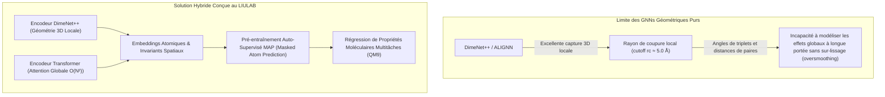

# 🧪 Stage de Recherche : IA Moléculaire & Chimie Computationnelle — LIULAB (Zhejiang University)

> **Cadre académique :** Stage recherche de 4e année (A4) — *Creative Technology* (ESILV / IFT).  
> **Période :** 14 Avril 2025 – 22 Août 2025 (4 mois intensifs) · Hangzhou, Zhejiang, Chine.  
> **Superviseur académique :** Xiao Xiao.  
> **Directeur de laboratoire & Tuteur d'accueil :** Prof. Ming Liu (LIULAB).  
> **Mentor direct :** Siyuan Yang.  
> **Document de référence :** Rapport de recherche & Soutenance académique (*Computational Chemistry: DimeNet++ and Transformer for Molecular Property Learning*).

---

## 🌟 1. Contexte Scientifique & Vision : L'IA au Service de la Fusion Nucléaire

La fusion nucléaire (au cœur du projet international **ITER** à Cadarache, France) représente la promesse d'une source d'énergie décarbonée, continue et virtuellement illimitée. L'un de ses défis technologiques les plus critiques réside dans la manipulation et la purification des **isotopes de l'hydrogène** :
- Le **Protium** ($^1\text{H}$),
- Le **Deutérium** ($^2\text{H}$ ou $\text{D}$),
- Le **Tritium** ($^3\text{H}$ ou $\text{T}$).

Le laboratoire **LIULAB** de l'Université du Zhejiang s'appuie sur une découverte scientifique majeure publiée dans *Science* :
> **Publication clé :** Liu, M., Zhang, L., Little, M. A., Kapil, V., Ceriotti, M., Yang, S., ... & Cooper, A. I. (2019). *Barely porous organic cages for hydrogen isotope separation*. **Science**, 366(6465), 613-620.

Ces **cages organiques faiblement poreuses** permettent une séparation isotopique par effet de tamisage cinétique et thermodynamique quantique. Cependant, explorer et concevoir de nouvelles structures moléculaires par synthèse chimique expérimentale et par simulations DFT (*Density Functional Theory*) traditionnelles est extrêmement coûteux en énergie, en temps de calcul et en solvants chimiques.

**Rôle de l'IA :** Modéliser et prédire en une fraction de seconde les propriétés structurales, stériques et électroniques des molécules pour accélérer le criblage virtuel (*virtual high-throughput screening*).

---

## 🎯 2. Problématique Centrale de R&D

> **Question de recherche :**  
> *Comment dépasser la limite de portée des réseaux de neurones sur graphes géométriques (GNNs) — excellents pour la géométrie locale 3D (angles, distances) mais intrinsèquement limités pour capter les dépendances globales — en y intégrant un encodeur Transformer et un protocole de pré-entraînement auto-supervisé ?*

---

## 📋 3. Livrables & Fiches Techniques Détaillées

Ce travail de recherche a fait l'objet de développements théoriques, algorithmiques et d'expérimentations sur cluster de calcul haute performance (HPC).

| Fiche | Thématique & Titre | Défi Scientifique & Preuve de Compétence | Stack Principale |
|:---|:---|:---|:---|
| **[[01 - Projects/Stage Recherche - Zhejiang University/Fiches Techniques/FT-ZJU01 - Modele Hybride DimeNet++ Transformer & QM9\|FT-ZJU01]]** | **Modèle Hybride DimeNet++ + Transformer & QM9** | Conception d'une architecture fusionnant le *directional message passing* (fonctions de Bessel & harmoniques sphériques) et l'attention globale Transformer avec encodages positionnels sur le benchmark QM9 (133 886 molécules). | PyTorch, PyTorch Geometric, QM9, MAE/RMSE |
| **[[01 - Projects/Stage Recherche - Zhejiang University/Fiches Techniques/FT-ZJU02 - Pre-entrainement Auto-Supervise Masked Atom Prediction (MAP)\|FT-ZJU02]]** | **Pré-entraînement Auto-Supervisé (MAP) & t-SNE** | Implémentation d'une tâche de pré-entraînement auto-supervisée par masquage probabiliste d'atomes (15 % masquage : 80/10/10) inspirée de MCRT. Analyse de l'espace latent par réduction dimensionnelle t-SNE. | Self-Supervised Learning, Cross-Entropy, t-SNE, MCRT |
| **[[01 - Projects/Stage Recherche - Zhejiang University/Fiches Techniques/FT-ZJU03 - Orchestration HPC & Calcul Distribue Multi-GPU avec SLURM\|FT-ZJU03]]** | **Orchestration HPC & Multi-GPU sous SLURM** | Déploiement et gestion conjointe de 10 pipelines de code en parallèle sur le cluster de calcul universitaire sous ordonnanceur SLURM. Résolution des goulots d'étranglement mémoire VRAM et reprise sur checkpoint. | SLURM, Multi-GPU, Linux HPC, Bash, Checkpointing |

---

## 🔬 4. Mécanismes Théoriques & Fondements Algorithmiques

### 4.1. DimeNet++ (Directional Message Passing)
Contrairement aux GNNs standards (GCN, GAT) qui ne considèrent que l'adjacence topologique, DimeNet++ modélise explicitement la géométrie spatiale 3D :
- **Distances de paires atomiques ($d_{ij}$) :** Projetées sur une base de fonctions de Bessel radiales sphériques (RBF).
- **Angles de triplets atomiques ($\alpha_{(ij, jk)}$) :** Projetés sur des harmoniques sphériques couplées avec les fonctions de Bessel 2D (SBF).
- **Invariance SE(3) :** Invariance stricte aux translations et rotations dans l'espace euclidien tridimensionnel.

### 4.2. Transformer & Auto-Attention Globale
L'encodeur Transformer calcule une matrice d'attention croisée complète entre tous les nœuds de la molécule :
$$\text{Attention}(Q, K, V) = \text{softmax}\left(\frac{QK^T}{\sqrt{d_k}}\right)V$$
Il permet à deux atomes situés aux extrémités opposées d'une macro-molécule ou d'une cage d'échanger de l'information sans perte d'intensité du gradient.

### 4.3. Masked Atom Prediction (MAP)
Inspiré des fondations de **MCRT** (*A universal foundation model for transfer learning in molecular crystals*, Feng et al., *Chemical Science* 2025) :
- Sélection aléatoire de **15 % des atomes** de chaque molécule :
  - **80 %** remplacés par le token `[MASK]`,
  - **10 %** remplacés par un atome tiré aléatoirement dans le dictionnaire $(\text{H}, \text{C}, \text{N}, \text{O}, \text{F})$,
  - **10 %** conservés inchangés.
- La tâche de reconstruction force le réseau à comprendre la valence chimique, les interactions stériques et l'électronégativité de l'environnement local.

---

## 📈 5. Synthèse des Résultats & Apports

1. **Amélioration systématique des métriques prédictives :** Le modèle hybride a surclassé le baseline DimeNet++ sur plusieurs cibles de régression du benchmark QM9, notamment sur les propriétés physiques corrélées aux effets électroniques à longue distance.
2. **Structuration de l'espace latent (t-SNE) :** Les projections t-SNE ont mis en évidence la formation naturelle de sous-groupes chimiques cohérents (cycles aromatiques, chaînes aliphatiques, degrés d'oxydation) sans aucune annotation préalable.
3. **Maîtrise opérationnelle d'un cluster HPC :** Gestion autonome des environnements logiciels, de la mémoire GPU (gradient checkpointing, scaling de batch) et de la parallélisation de 10 jobs simultanés sous SLURM.

---

## 🔭 6. Perspectives & Roadmap de Recherche (2025 – 2026)

Le plan de travail établi avec le laboratoire prévoit les étapes suivantes :
- **Coordinate Noise Augmentation :** Injection programmée de bruit gaussien sur les coordonnées spatiales 3D lors des couches d'attention pour renforcer la robustesse stérique du Transformer.
- **Taux de complétion MAP :** Évaluation quantitative poussée du pourcentage de succès de reconstruction selon l'hétéroatome masqué.
- **Fine-Tuning Énergétique :** Transfer learning direct sur les propriétés thermodynamiques (énergie interne $U_0$, écart HOMO-LUMO, enthalpie $H$).

---

## 📚 7. Références Bibliographiques Étudiées & Citées

1. **Vaswani, A. et al. (2017).** *Attention is all you need*. NeurIPS 30.
2. **Liu, M. et al. (2019).** *Barely porous organic cages for hydrogen isotope separation*. **Science**, 366(6465), 613-620.
3. **Gasteiger, J. et al. (2020).** *Fast and uncertainty-aware directional message passing for non-equilibrium molecules (DimeNet++)*. arXiv:2011.14115.
4. **Choudhary, K., & DeCost, B. (2021).** *Atomistic line graph neural network for improved materials property predictions (ALIGNN)*. npj Computational Materials, 7(1), 185.
5. **Feng, M. et al. (2025).** *A universal foundation model for transfer learning in molecular crystals (MCRT)*. **Chemical Science**.
6. **Zhu, F. et al. (2023).** *FastDimeNet: Training DimeNet in 22 minutes*. ICPP 2023, 274-284.

---

## 🔗 Liens Internes du Coffre
- [[02 - Areas/Profil & Carrière/Expériences Professionnelles|💼 Fiche Parcours Professionnel — Expérience ZJU]]
- [[02 - Areas/Profil & Carrière/Cartographie des Compétences & Stack|⚡ Cartographie des Compétences & Stack]]
- [[Dashboard|🏠 Retour au Dashboard]]
