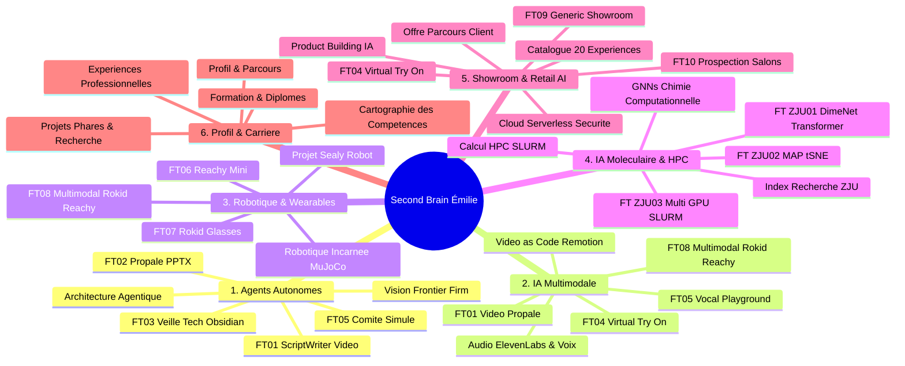

# 🗺️ MOC — Carte des Connaissances & Atlas du Graphe

> **Bienvenue dans l'Atlas relationnel de ton Second Brain.**  
> Cette carte structure l'ensemble des nœuds de ton coffre en **6 constellations thématiques interconnectées**. Elle guide la navigation et garantit la densité relationnelle du graphe global dans Obsidian.

---

## 🌌 1. Constellation : Agents Autonomes & Orchestration LLM

> Systèmes multi-agents, décomposition de tâches, méta-prompting et automatisation des processus de conseil.

- **Nœud Pilier :** [[02 - Areas/Compétences & R&D IA/Architecture Agentique & Meta-Prompting|Architecture Agentique & Meta-Prompting]]
- **Vision Stratégique :** [[03 - Resources/Vision Frontier Firm & Organisation Agentique|Vision : La « Frontier Firm » & l'Économie Agentique]]
- **Fiches Réalisations :**
  - [[01 - Projects/Stage OnePoint - AI Lab/Fiches Techniques/FT01 - Agent Video Propale Remotion Lambda|FT01 — Agent Vidéo Propale (ScriptWriter / RenderPlan)]]
  - [[01 - Projects/Stage OnePoint - AI Lab/Fiches Techniques/FT02 - Agent Proposition Commerciale PPTX|FT02 — Agent Proposition Commerciale (Claude 3.5 Managed Agents)]]
  - [[01 - Projects/Stage OnePoint - AI Lab/Fiches Techniques/FT03 - Agent Veille Tech Obsidian|FT03 — Agent Veille Tech (GitHub Actions & Gemini 2.5 Flash)]]
  - [[01 - Projects/Stage OnePoint - AI Lab/Fiches Techniques/FT05 - Vocal Playground et Comite Simule|FT05 — Comité Simulé (Débat contradictoire multi-experts)]]

---

## 🎬 2. Constellation : Video-as-Code & IA Multimodale

> Génération programmatique image/vidéo/son, clonage vocal et synchronisation milliseconde.

- **Nœuds Piliers :** 
  - [[02 - Areas/Compétences & R&D IA/IA Multimodale (Audio, Voix, Vidéo, Vision)|IA Multimodale (Audio, Voix, Vidéo, Vision)]]
  - [[02 - Areas/Compétences & R&D IA/Video-as-Code & Motion Design (Remotion & Lambda)|Video-as-Code & Motion Design (Remotion & Lambda)]]
- **Fiches Réalisations :**
  - [[01 - Projects/Stage OnePoint - AI Lab/Fiches Techniques/FT01 - Agent Video Propale Remotion Lambda|FT01 — Moteur Video-as-Code Remotion & AWS Lambda]]
  - [[01 - Projects/Stage OnePoint - AI Lab/Fiches Techniques/FT05 - Vocal Playground et Comite Simule|FT05 — Vocal Playground (Clonage 11 langues & Web Audio)]]
  - [[01 - Projects/Stage OnePoint - AI Lab/Fiches Techniques/FT04 - Experiences Retail AI Virtual Try On|FT04 — Virtual Try-On (FLUX Kontext & FASHN v1.6)]]
  - [[01 - Projects/Stage OnePoint - AI Lab/Fiches Techniques/FT08 - Multimodal Rokid x Reachy|FT08 — Streaming Multimodal WebSocket (<80ms)]]

---

## 🦾 3. Constellation : Robotique Incarnée, Wearables & Vision Temps Réel

> Interaction homme-machine, IA incarnée (*Embodied AI*), affichage tête haute AR et simulation physique.

- **Nœud Pilier :** [[02 - Areas/Compétences & R&D IA/Robotique Incarnée & Informatique Ambiante (Reachy, Rokid, MuJoCo)|Robotique Incarnée & Informatique Ambiante]]
- **Recherche Matérielle :** [[02 - Areas/Profil & Carrière/Projets Phares & Recherche|Projets Phares (Robot Sealy, Vision Somnolence, ESP32 WebSocket)]]
- **Fiches Réalisations :**
  - [[01 - Projects/Stage OnePoint - AI Lab/Fiches Techniques/FT06 - Reachy Mini Robotique et MuJoCo|FT06 — Reachy Mini & Simulation 3D MuJoCo]]
  - [[01 - Projects/Stage OnePoint - AI Lab/Fiches Techniques/FT07 - Lunettes IA Rokid Glasses et Wearables|FT07 — Lunettes AR Rokid Glasses (HUD Micro-OLED)]]
  - [[01 - Projects/Stage OnePoint - AI Lab/Fiches Techniques/FT08 - Multimodal Rokid x Reachy|FT08 — Projet Multimodal : Rokid x Reachy]]

---

## ⚛️ 4. Constellation : Deep Learning Moléculaire & Calcul HPC

> GNNs géométriques 3D, attention globale Transformer, apprentissage auto-supervisé et calcul multi-GPU sur supercalculateur.

- **Nœuds Piliers :**
  - [[02 - Areas/Compétences & R&D IA/Graph Neural Networks & Chimie Computationnelle (DimeNet++, Transformer, QM9)|Graph Neural Networks & Chimie Computationnelle]]
  - [[02 - Areas/Compétences & R&D IA/Calcul Haute Performance & Distributed Deep Learning (SLURM, Multi-GPU)|Calcul Haute Performance & Distributed Deep Learning (SLURM)]]
- **Hub de Recherche :** [[01 - Projects/Stage Recherche - Zhejiang University/Index du Stage Recherche ZJU|Index du Stage Recherche ZJU (LIULAB)]]
- **Fiches Réalisations :**
  - [[01 - Projects/Stage Recherche - Zhejiang University/Fiches Techniques/FT-ZJU01 - Modele Hybride DimeNet++ Transformer & QM9|FT-ZJU01 — DimeNet++ + Transformer & Benchmark QM9]]
  - [[01 - Projects/Stage Recherche - Zhejiang University/Fiches Techniques/FT-ZJU02 - Pre-entrainement Auto-Supervise Masked Atom Prediction (MAP)|FT-ZJU02 — Pré-entraînement MAP & Analyse t-SNE]]
  - [[01 - Projects/Stage Recherche - Zhejiang University/Fiches Techniques/FT-ZJU03 - Orchestration HPC & Calcul Distribue Multi-GPU avec SLURM|FT-ZJU03 — Orchestration Multi-GPU sous SLURM]]

---

## 🎪 5. Constellation : Retail AI, Showroom & Stratégie Livepoint

> Démonstrateurs interactifs, architecture serverless sécurisée et design de parcours client pour comités exécutifs.

- **Nœuds Piliers :**
  - [[02 - Areas/Compétences & R&D IA/Product Building IA & Showroom Expérientiel|Product Building IA & Showroom Expérientiel]]
  - [[02 - Areas/Compétences & R&D IA/Cloud Serverless & Sécurité des Systèmes IA (AWS, Vercel)|Cloud Serverless & Sécurité des Systèmes IA]]
- **Stratégie Commerciale & Catalogue :**
  - [[01 - Projects/Stage OnePoint - AI Lab/Catalogue des 20 Expériences de l'Agentic Livepoint|Catalogue des 20 Expériences du Livepoint]]
  - [[01 - Projects/Stage OnePoint - AI Lab/Offre & Parcours Client — Agentic Livepoint|Offre & Parcours Client (Livepoint Onepoint)]]
- **Fiches Réalisations :**
  - [[01 - Projects/Stage OnePoint - AI Lab/Fiches Techniques/FT04 - Experiences Retail AI Virtual Try On|FT04 — Suite Retail AI & Virtual Try-On]]
  - [[01 - Projects/Stage OnePoint - AI Lab/Fiches Techniques/FT09 - Generic Showroom Experience Livepoint|FT09 — Generic Showroom (Kiosque Samsung Flip 55-85")]]
  - [[01 - Projects/Stage OnePoint - AI Lab/Fiches Techniques/FT10 - Prospection Salons et Curation Tech|FT10 — Prospection Salons & Curation Tech]]

---

## 👩‍💻 6. Constellation : Profil Ingénieure, Compétences & Recherche

> Identité professionnelle, diplômes, stack technique et projets personnels.

- **Nexus Central :** [[Dashboard|🏠 Dashboard Principal]]
- **Profil Général :** [[02 - Areas/Profil & Carrière/Profil & Parcours — Émilie Jiang|Profil & Parcours — Émilie Jiang]]
- **Notes Détaillées :**
  - [[02 - Areas/Profil & Carrière/Expériences Professionnelles|Expériences Professionnelles (OnePoint, ZJU LIULAB, Pitié-Salpêtrière)]]
  - [[02 - Areas/Profil & Carrière/Projets Phares & Recherche|Projets Phares & Recherche (Sealy, TinyGrad WebGPU, ESP32)]]
  - [[02 - Areas/Profil & Carrière/Formation & Diplômes|Formation & Diplômes (ESILV, IFT, Sorbonne Université / CUPGE)]]
  - [[02 - Areas/Profil & Carrière/Cartographie des Compétences & Stack|Cartographie Complète des Compétences & Stack]]
  - [[02 - Areas/Développement Personnel & Compétences|Domaine : Compétences & Standards]]

---

## 🔗 Liens Fondations
- [[Dashboard|🏠 Dashboard]]
- [[README|📖 README du Coffre]]
- [[03 - Resources/Méthode PARA|📚 Méthode PARA]]
