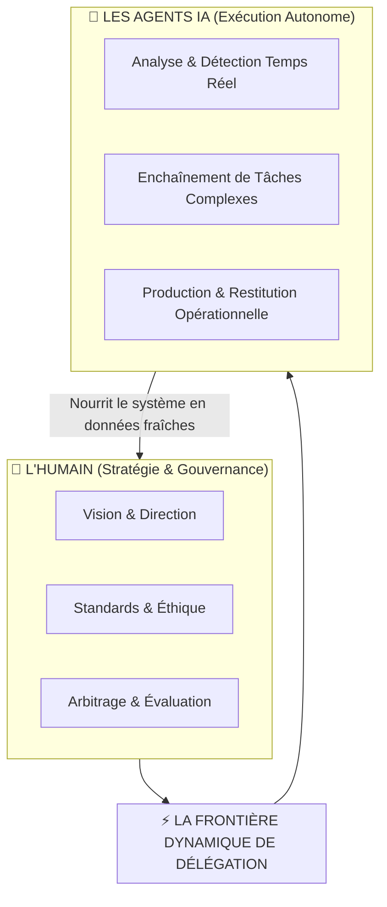

# 🌐 La « Frontier Firm » : Théorie & Modèle de l'Organisation Agentique

> **Source :** `[AI LAB] Deck marketing de l'agentique livepoint V2.pptx` (Diapositives 3 à 8 & 63 à 67).  
> **Concept Clé :** Modèle théorique développé par Microsoft et formalisé par Onepoint pour qualifier les entreprises pionnières qui réorganisent leur appareil de production autour de l'IA agentique.

---

## 📌 1. Définition : Qu'est-ce qu'une « Frontier Firm » ?

Une **Frontier Firm** est une organisation qui repense intégralement son modèle opérationnel autour d'une **collaboration étroite et hybride entre humains et agents IA** :
- **L'Humain :** Définit la vision, la stratégie d'entreprise, les standards de qualité, l'évaluation éthique et les règles du jeu.
- **L'Agent IA :** Décide, exécute et orchestre de manière autonome une part croissante des flux de travail opérationnels.

---

## ⚖️ 2. La Rupture : Organisation pour l'Info Rare vs Système Auto-Alimenté

| Dimension | 🏛️ L'Organisation Traditionnelle (Hier) | 🚀 La Frontier Firm Agentique (Aujourd'hui) |
|:---|:---|:---|
| **Contexte de l'information** | L'information est rare, chère et lente à collecter. | L'information est surabondante, instantanée et à coût marginal nul. |
| **Structure hiérarchique** | Nombreuses strates intermédiaires servant de filtres et de relais. | Réseau fluide et aplati reliant directement décideurs et agents. |
| **Flux de décision** | L'information monte laborieusement, la décision descend lentement. | Décisions opérationnelles prises en direct par les agents selon des règles strictes. |
| **Exemple typique** | **Le CRM que personne ne remplit :** perçu comme une corvée administrative sans valeur directe. | **Le CRM auto-alimenté :** les agents croisent les échanges vocaux et mails pour renseigner le CRM et recommander des actions. |
| **Postulat fondamental** | La donnée est stockée dans des silos statiques. | **« L'IA amplifie la donnée existante, elle ne la crée pas. »** Le système est auto-alimenté : chaque action produit la donnée de la suivante. |

---

## 📉 3. L'Impact Économique : Le Risque du Modèle « À la Licence »

Le cas d'école documenté dans le deck marketing illustre la transition brutale des modèles logiciels :
- **Le Casse-tête de la Facturation par Utilisateur (Seat-Based Pricing) :**
  - Des acteurs historiques comme Salesforce facturaient traditionnellement leurs logiciels au nombre d'employés connectés (*per-seat license*).
  - Avec l'automatisation agentique remplaçant ou condensant des tâches humaines, le besoin en licences individuelles a chuté, entraînant une chute boursière de **−31 %** début 2026.
- **La Monétisation Agentique (Exemple Agentforce) :**
  - Pivot stratégique réussi vers la facturation à la valeur/action : Agentforce a généré **1,2 Md$ d'ARR** (revenus récurrents annuels), relevant les objectifs annuels à 11,35 Md$.
  - Rebond boursier immédiat de **+40 %** en août 2026.
- **Enseignement pour les clients du Lab :** Les modèles économiques internes doivent eux aussi évoluer : on ne mesure plus la valeur au temps passé ou aux têtes, mais aux résultats livrés par les binômes humains-agents.

---

## 🔄 4. Les 4 Piliers du Shift Organisationnel

Pour ne pas réduire l'IA à un simple « projet informatique », la transformation doit actionner 4 leviers simultanés :
1. **Modèle Économique :** Réallocation des budgets vers la puissance de calcul agentique et monétisation des services à forte valeur humaine.
2. **Modèle Organisationnel :** Décloisonnement des silos métiers et refonte des processus pour intégrer des agents au sein des comités et des équipes.
3. **Gestion des Compétences :** Montée en compétence des collaborateurs vers le rôle de *Superviseur d'Agents*, d'expert en métadonnées et de pilote de stratégie.
4. **Réattribution des Responsabilités :** Clarification contractuelle et éthique des périmètres d'action délégués aux machines.

---

## 🔗 Liens & Références
- [[01 - Projects/Stage OnePoint - AI Lab/Index du Stage|Index général du stage OnePoint]]
- [[01 - Projects/Stage OnePoint - AI Lab/Offre & Parcours Client — Agentic Livepoint|Offre & Parcours Client]]
- [[01 - Projects/Stage OnePoint - AI Lab/Catalogue des 20 Expériences de l'Agentic Livepoint|Catalogue des Expériences Livepoint]]
