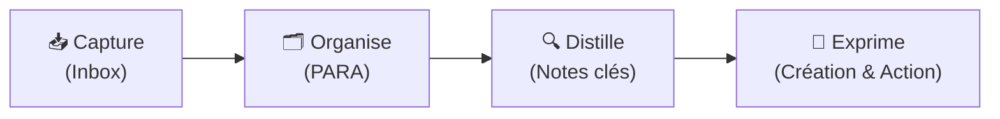

# 🧠 Second Brain — Émilie

Bienvenue dans ton **Second Brain** personnel sur Obsidian ! Ce coffre est structuré selon la méthode **P.A.R.A.** (*Projects, Areas, Resources, Archives*) développée par Tiago Forte.

---

## 🔥 Focus Actuel — Stage OnePoint AI Lab

> **Projet Majeur :** [[01 - Projects/Stage OnePoint - AI Lab/Index du Stage|🏢 Stage M2 — AI Innovation & Agentic Systems (OnePoint AI Lab)]]  
> Déploiement de briques agentiques, produits multimodaux, robotique incarnée et démonstrateurs immersifs pour l'**Agentic Livepoint**.

### 📋 Fiches Techniques Projets (OnePoint)
- [[01 - Projects/Stage OnePoint - AI Lab/Fiches Techniques/FT01 - Agent Video Propale Remotion Lambda|FT01 — Agent Vidéo Propale (Remotion & Lambda)]]
- [[01 - Projects/Stage OnePoint - AI Lab/Fiches Techniques/FT02 - Agent Proposition Commerciale PPTX|FT02 — Agent Proposition Commerciale PPTX (Claude)]]
- [[01 - Projects/Stage OnePoint - AI Lab/Fiches Techniques/FT03 - Agent Veille Tech Obsidian|FT03 — Agent Veille Événementielle Tech (Obsidian)]]
- [[01 - Projects/Stage OnePoint - AI Lab/Fiches Techniques/FT04 - Experiences Retail AI Virtual Try On|FT04 — Suite Retail AI & Virtual Try-On]]
- [[01 - Projects/Stage OnePoint - AI Lab/Fiches Techniques/FT05 - Vocal Playground et Comite Simule|FT05 — Vocal Playground & Comité Simulé]]
- [[01 - Projects/Stage OnePoint - AI Lab/Fiches Techniques/FT06 - Reachy Mini Robotique et MuJoCo|FT06 — Reachy Mini & Simulation MuJoCo]]
- [[01 - Projects/Stage OnePoint - AI Lab/Fiches Techniques/FT07 - Lunettes IA Rokid Glasses et Wearables|FT07 — Lunettes IA Rokid & Wearables]]
- [[01 - Projects/Stage OnePoint - AI Lab/Fiches Techniques/FT08 - Multimodal Rokid x Reachy|FT08 — Projet Multimodal : Rokid x Reachy]]
- [[01 - Projects/Stage OnePoint - AI Lab/Fiches Techniques/FT09 - Generic Showroom Experience Livepoint|FT09 — Generic Showroom Experience (Samsung Flip)]]
- [[01 - Projects/Stage OnePoint - AI Lab/Fiches Techniques/FT10 - Prospection Salons et Curation Tech|FT10 — Prospection Salons & Curation Tech]]

### 🧠 Compétences Acquises & R&D IA
- [[02 - Areas/Compétences & R&D IA/Architecture Agentique & Meta-Prompting|Architecture Agentique & Meta-Prompting]]
- [[02 - Areas/Compétences & R&D IA/IA Multimodale (Audio, Voix, Vidéo, Vision)|IA Multimodale (Audio, Voix, Vidéo, Vision)]]
- [[02 - Areas/Compétences & R&D IA/Video-as-Code & Motion Design (Remotion & Lambda)|Video-as-Code & Motion Design (Remotion & Lambda)]]
- [[02 - Areas/Compétences & R&D IA/Cloud Serverless & Sécurité des Systèmes IA (AWS, Vercel)|Cloud Serverless & Sécurité des Systèmes IA (AWS, Vercel)]]
- [[02 - Areas/Compétences & R&D IA/Robotique Incarnée & Informatique Ambiante (Reachy, Rokid, MuJoCo)|Robotique Incarnée & Informatique Ambiante (Reachy, Rokid, MuJoCo)]]
- [[02 - Areas/Compétences & R&D IA/Product Building IA & Showroom Expérientiel|Product Building IA & Showroom Expérientiel]]

---

## ⚡ Navigation Rapide

| Dossier | Description | Statut |
| :--- | :--- | :--- |
| [[00 - Inbox/Bienvenue dans ton Second Brain\|📥 00 - Inbox]] | Idées brutes, captures rapides, notes à traiter | En attente de tri |
| [[01 - Projects/Stage OnePoint - AI Lab/Index du Stage\|🎯 01 - Projects]] | Projets en cours avec échéance ou livrable | Actif (OnePoint AI Lab) |
| [[02 - Areas/Développement Personnel & Compétences\|🌱 02 - Areas]] | Domaines de responsabilité continus (santé, compétences, R&D) | Long terme |
| [[03 - Resources/Méthode PARA\|📚 03 - Resources]] | Références, guides, fiches de lecture, cheat sheets | Permanent |
| [[04 - Archives/\|📦 04 - Archives]] | Projets terminés, notes inactives | Archivé |

---

## 🚀 Processus CODE (Workflow)

1. **Capturer (Capture) :** Dépose rapidement tes pensées, liens et idées dans `00 - Inbox`.
2. **Organiser (Organize) :** Déplace régulièrement tes notes vers les dossiers `Projects`, `Areas` ou `Resources`.
3. **Distiller (Distill) :** Mets en gras, surligne et résume les points clés de tes notes.
4. **Exprimer (Express) :** Utilise tes notes interconnectées pour créer, produire et mener à bien tes projets.

---

## 🛠️ Modèles disponibles (_Templates)
- [[_Templates/Modèle - Note de Projet|Modèle de Projet]]
- [[_Templates/Modèle - Note Quotidienne|Modèle de Note Quotidienne]]
- [[_Templates/Modèle - Fiche de Lecture & Ressource|Modèle de Fiche de Lecture & Ressource]]
- [[_Templates/Modèle - Note Permanente (Zettelkasten)|Modèle de Note Permanente]]

---
*Dernière mise à jour : 2026-09-18*
