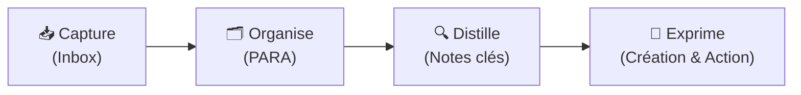

# 🧠 Second Brain — Émilie

Bienvenue dans ton **Second Brain** personnel sur Obsidian ! Ce coffre est structuré selon la méthode **P.A.R.A.** (*Projects, Areas, Resources, Archives*) développée par Tiago Forte.

---

## ⚡ Navigation Rapide

| Dossier | Description | Statut |
| :--- | :--- | :--- |
| [[00 - Inbox/Bienvenue dans ton Second Brain\|📥 00 - Inbox]] | Idées brutes, captures rapides, notes à traiter | En attente de tri |
| [[01 - Projects/Configuration du Second Brain\|🎯 01 - Projects]] | Projets en cours avec échéance ou livrable | Actif |
| [[02 - Areas/Développement Personnel & Compétences\|🌱 02 - Areas]] | Domaines de responsabilité continus (santé, finances, carrière) | Long terme |
| [[03 - Resources/Méthode PARA\|📚 03 - Resources]] | Références, guides, fiches de lecture, cheat sheets | Permanent |
| [[04 - Archives/\|📦 04 - Archives]] | Projets terminés, notes inactives | Archivé |

---

## 🚀 Processus CODE (Workflow)

1. **Capturer (Capture) :** Dépose rapidement tes pensées, liens et idées dans `00 - Inbox`.
2. **Organiser (Organize) :** Déplace régulièrement tes notes vers les dossiers `Projects`, `Areas` ou `Resources`.
3. **Distiller (Distill) :** Mets en gras, surligne et résume les points clés de tes notes.
4. **Exprimer (Express) :** Utilise tes notes interconnectées pour créer, produire et mener à bien tes projets.

---

## 🛠️ Modèles disponibles (_Templates)
- [[_Templates/Modèle - Note de Projet|Modèle de Projet]]
- [[_Templates/Modèle - Note Quotidienne|Modèle de Note Quotidienne]]
- [[_Templates/Modèle - Fiche de Lecture & Ressource|Modèle de Fiche de Lecture & Ressource]]
- [[_Templates/Modèle - Note Permanente (Zettelkasten)|Modèle de Note Permanente]]

---
*Dernière mise à jour : 2026-09-15*
