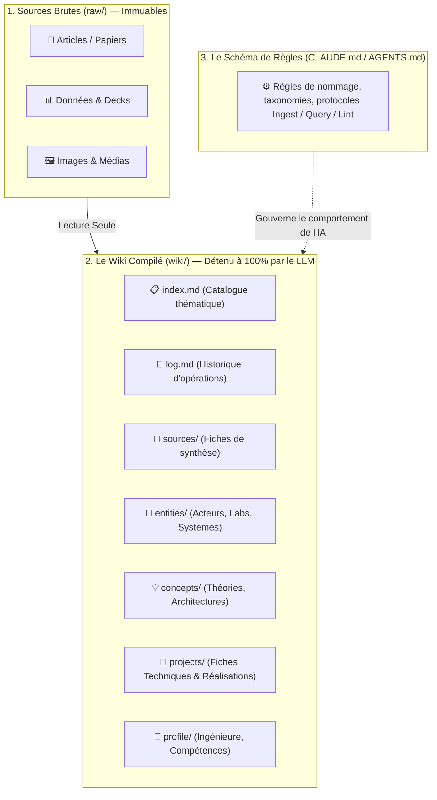

# 🧠 Concept : Pattern LLM Wiki (Andrej Karpathy)

> *“Obsidian est l'IDE ; le LLM est le programmeur ; le wiki est la base de code.”*  
> — Andrej Karpathy (2026)

---

## 🎯 1. La Thèse Centrale : Dépasser les Limites du RAG Naïf

La plupart des systèmes documentaires actuels basés sur les LLMs reposent sur le **RAG (Retrieval-Augmented Generation)** ponctuel :
- L'utilisateur envoie une collection de documents bruts.
- À chaque requête, le LLM découpe, indexe des fragments, récupère des chunks et génère une réponse à la volée.
- **Le problème majeur :** L'IA redécouvre la connaissance *de zéro* à chaque question. Il n'y a **aucune accumulation**, aucune consolidation dans le temps. Pour une question fine nécessitant de croiser 5 documents, le LLM doit ré-extraire et ré-assembler les fragments à chaque session.

### L'Approche LLM Wiki :
Au lieu de fouiller les documents bruts à chaque requête, le LLM construit et maintient un **wiki persistant de fichiers Markdown interconnectés** qui s'intercale entre l'humain et les sources brutes :
- À l'ajout d'une source, le LLM ne se contente pas de l'indexer : il la lit, extrait les faits clés, crée une synthèse, met à jour les fiches d'entités, révise les concepts, signale les contradictions avec d'anciens documents et consolide la synthèse générale.
- **La connaissance est compilée une seule fois puis maintenue à jour continuellement**, au lieu d'être recalculée à chaque question.
- Le wiki est un **artéfact cumulatif (*compounding artifact*)** : il s'enrichit à chaque source ingérée et à chaque question posée.

---

## 🏗️ 2. L'Architecture en 3 Couches

1. **`raw/` (Sources Brutes) :** Collection curée de documents sources immuables. L'humain les dépose ; l'IA les lit mais ne les altère jamais. C'est la source de vérité première.
2. **`wiki/` (Le Wiki Compilé) :** Répertoire de pages Markdown générées et entretenues par l'IA. L'humain explore et lit ; l'IA écrit, croise, met à jour et maintient la cohérence.
3. **`CLAUDE.md` / `AGENTS.md` (Le Schéma) :** La constitution opérationnelle qui discipline l'agent IA pour en faire un mainteneur rigoureux de base de connaissances.

---

## ⚡ 3. Les Trois Opérations Fondamentales

| Opération | Déclencheur | Rôle du LLM | Résultat & Traçabilité |
|:---|:---|:---|:---|
| **Ingest (`ingest`)** | Ajout d'une source dans `raw/` | Lit la source, rédige une fiche dans `wiki/sources/`, met à jour les entités/concepts impactés, ajuste `wiki/index.md`. | Enregistrement chronologique dans `wiki/log.md`. |
| **Query (`query`)** | Question / exploration utilisateur | Consulte `wiki/index.md`, explore les pages cibles, synthétise avec citations. Si la réflexion apporte une idée neuve, **la consigne dans le wiki**. | Aucune bonne idée ne disparaît dans l'historique du chat. |
| **Lint (`lint`)** | Audit régulier de santé | Traque les contradictions, claims périmés, nœuds orphelins, concepts orphelins de fiche, liens cassés. Propose des axes d'investigation. | Rapport d'audit et consignation dans `wiki/log.md`. |

---

## 💡 4. Pourquoi ce Système Fonctionne : La Fin du Fardeau de Tenue de Wiki

La partie pénible d'un wiki personnel n'a jamais été la lecture ou la réflexion : c'est la **tenue de registre (bookkeeping)**.
- Mettre à jour les liens croisés, garder les résumés à jour, noter quand une donnée contredit une ancienne, maintenir la cohérence de 50 pages...
- Les humains abandonnent leurs wikis et seconds brains parce que le coût d'entretien croît plus vite que la valeur perçue.
- **Les LLMs ne s'ennuient pas, n'oublient aucun lien et peuvent toucher 15 fichiers en une passe.** Le coût de maintenance devient quasi nul.

> Le rôle de l'humain est de curer les sources, orienter les analyses, poser les bonnes questions et réfléchir aux implications.  
> Le rôle de l'IA est tout le reste.

---

## 🔗 Liens & Connexions Graphe
- [[CLAUDE.md|System Schema : CLAUDE.md]]
- [[wiki/index|📋 Index du Wiki]]
- [[wiki/log|📜 Operations Log]]
- [[wiki/concepts/Vision Frontier Firm & Organisation Agentique|Concept : Vision Frontier Firm]]
- [[wiki/concepts/Architecture Agentique & Meta-Prompting|Concept : Architecture Agentique]]
- [[Dashboard|🏠 Dashboard Principal]]
